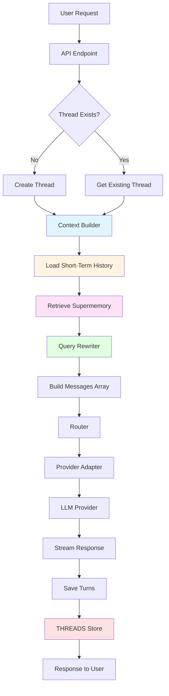
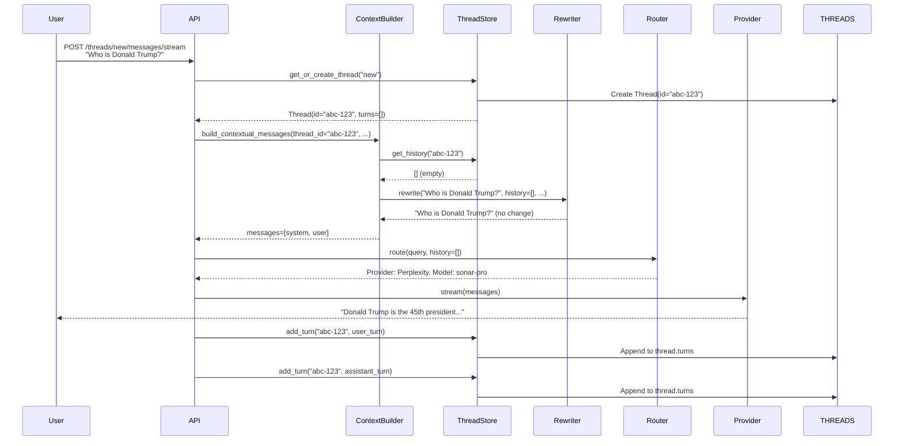
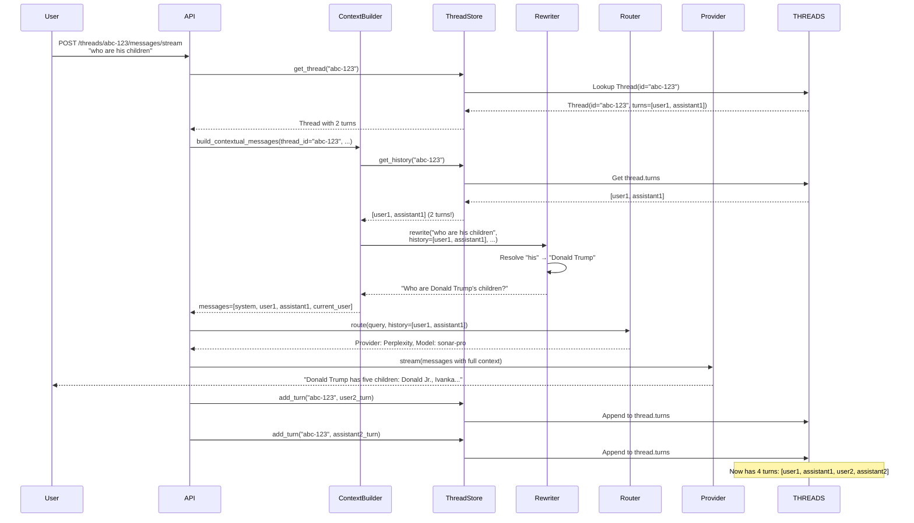
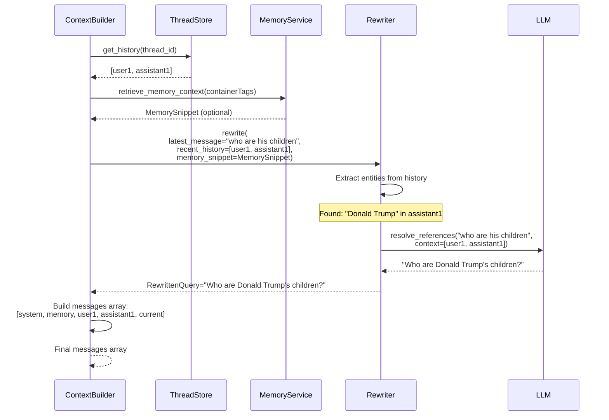
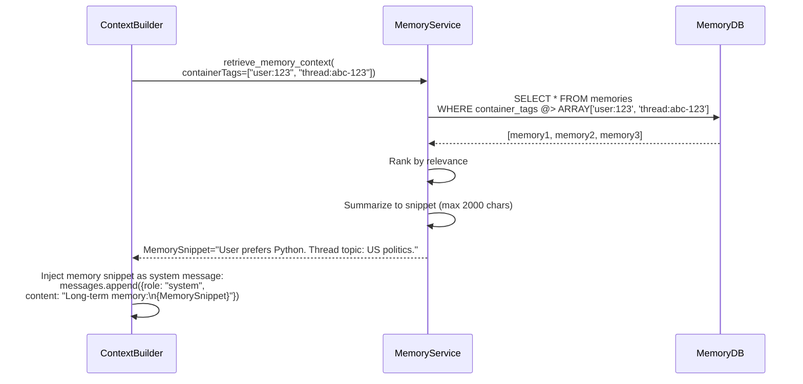

# Memory Pipeline Architecture

## 1. High-Level Diagram

### Mermaid Flow Diagram



### ASCII Flow Diagram

```
┌─────────────┐
│ User Request│
└──────┬──────┘
       │
       ▼
┌─────────────────┐
│  API Endpoint   │
│ /threads/{id}/  │
│ messages/stream │
└──────┬──────────┘
       │
       ├─► Create/Get Thread
       │
       ▼
┌─────────────────┐
│ Context Builder │ ◄─── Core Component
└──────┬──────────┘
       │
       ├─► Load Short-Term History (threads_store)
       │   └─► get_history(thread_id) → List[Turn]
       │
       ├─► Retrieve Supermemory (memory_service)
       │   └─► retrieve_memory_context(containerTags) → MemorySnippet
       │
       └─► Query Rewriter (query_rewriter / llm_context_extractor)
           └─► rewrite(message, history, memory) → RewrittenQuery
       │
       ▼
┌─────────────────┐
│ Messages Array   │
│ [system,         │
│  memory,         │
│  history...,     │
│  current]        │
└──────┬──────────┘
       │
       ▼
┌─────────────────┐
│  Router          │
│ (Select Provider)│
└──────┬──────────┘
       │
       ▼
┌─────────────────┐
│ Provider Adapter │
│ (Perplexity,     │
│  OpenAI, etc.)   │
└──────┬──────────┘
       │
       ▼
┌─────────────────┐
│  LLM Provider    │
│  (Streaming)     │
└──────┬──────────┘
       │
       ├─► Stream chunks to user
       │
       └─► Save turns to THREADS store
           └─► add_turn(thread_id, Turn(...))
```

---

## 2. Sequence Diagrams

### First Message Sequence



### Follow-up Message Sequence



### Rewriter Integration Sequence



### Supermemory Retrieval Sequence



---

## 3. Data Structure Definitions

### Thread

```python
@dataclass
class Thread:
    """Thread with conversation turns."""
    thread_id: str  # Unique identifier (UUID string)
    turns: List[Turn] = field(default_factory=list)  # Chronological conversation turns
```

**Properties:**
- `thread_id`: Immutable identifier, used as key in `THREADS` dict
- `turns`: Mutable list, grows with each conversation turn
- Persists across HTTP requests within same process

### Turn

```python
@dataclass
class Turn:
    """A single conversation turn."""
    role: str  # "user" | "assistant" | "system" | "tool"
    content: str  # Message text
```

**Properties:**
- `role`: Message role (user or assistant for conversation turns)
- `content`: Full message text
- Stored in chronological order in `thread.turns`

### ContextPayload

```python
@dataclass
class ContextualMessagesResult:
    """Result of building contextual messages."""
    messages: List[Dict[str, str]]  # Final messages array for LLM
    rewritten_query: Optional[str] = None  # Rewritten user message
    memory_snippet: Optional[str] = None  # Long-term memory snippet
    short_term_history: List[Dict[str, str]] = None  # Previous turns
    entities: List[Dict[str, Any]] = None  # Extracted entities
    is_ambiguous: bool = False  # Whether query needs disambiguation
    disambiguation_data: Optional[Dict[str, Any]] = None
```

**Properties:**
- `messages`: Complete array sent to LLM provider
- `rewritten_query`: Context-aware version of user message
- `memory_snippet`: Summarized long-term memory
- `short_term_history`: Previous conversation turns
- `entities`: Extracted entities for reference resolution

### RewriterPayload

```python
@dataclass
class QueryRewriterInput:
    """Input to the query rewriter."""
    thread_id: str
    user_id: Optional[str]
    latest_user_message: str  # Original user message
    recent_history: List[Dict[str, str]]  # Previous turns (oldest → newest)
    memory_snippet: Optional[str] = None  # Long-term memory
```

**Properties:**
- `latest_user_message`: Current user message to rewrite
- `recent_history`: Previous conversation turns for context
- `memory_snippet`: Long-term memory for additional context

### MemorySnippet

```python
@dataclass
class MemoryContext:
    """Long-term memory context."""
    memories: List[Memory]  # Retrieved memories
    snippet: str  # Summarized snippet (max 2000 chars)
    container_tags: List[str]  # Tags used for retrieval
```

**Properties:**
- `memories`: Raw memories from database
- `snippet`: Concise summary for injection into prompt
- `container_tags`: Tags used for retrieval (e.g., `["user:123", "thread:abc-123"]`)

---

## 4. Detailed Pipeline Explanation

### Stage 1: API Entrypoint

**Input:**
- HTTP request with `thread_id` (or "new")
- User message content
- Headers: `X-Org-Id`, etc.

**Process:**
1. Extract `thread_id` from URL or request body
2. If `thread_id == "new"`, generate new UUID
3. Sanitize user input
4. Call context builder

**Output:**
- `thread_id` (consistent across requests)
- Sanitized user content
- Metadata (org_id, user_id, etc.)

**Key Invariant:** Same `thread_id` must be reused for follow-up messages.

### Stage 2: Context Builder

**Input:**
- `thread_id`
- `latest_user_message`
- `user_id`, `org_id`
- Flags: `use_memory`, `use_query_rewriter`

**Process:**
1. **Load Short-Term History** (read-only)
   - Call `get_history(thread_id, max_turns=12)`
   - Returns `List[Turn]` (previous conversation turns)
   - MUST be called FIRST, before processing current message

2. **Retrieve Supermemory** (optional)
   - Call `memory_service.retrieve_memory_context(containerTags)`
   - `containerTags = [f"user:{user_id}", f"thread:{thread_id}"]`
   - Returns `MemorySnippet` or `None`
   - Summarized to max 2000 characters

3. **Query Rewriter** (optional)
   - Call `rewriter.rewrite(latest_message, history, memory)`
   - Receives full context (history + memory)
   - Returns rewritten query or original on failure
   - Non-destructive: original message always preserved

4. **Build Messages Array**
   - Start with system prompts
   - Add memory snippet (if available) as system message
   - Add all previous turns in chronological order
   - Add current user message (original + rewritten if available)

**Output:**
- `ContextualMessagesResult` with complete messages array

**Key Invariant:** History MUST be loaded before current message is processed.

### Stage 3: Router

**Input:**
- Query (latest user message)
- Conversation history
- Metadata (org preferences, etc.)

**Process:**
1. Analyze query intent
2. Consider conversation history
3. Select optimal provider/model
4. Return routing decision

**Output:**
- Provider selection (e.g., Perplexity Sonar)
- Model selection (e.g., `sonar-pro`)
- Reasoning (e.g., "Factual question, needs web search")

**Key Invariant:** Router does NOT modify context—all providers receive same messages array.

### Stage 4: Provider Adapter

**Input:**
- `messages` array (from context builder)
- Provider type (from router)
- Model name (from router)
- API key

**Process:**
1. Format messages for provider-specific API
2. Call provider streaming endpoint
3. Stream response chunks back

**Output:**
- Streaming response chunks
- Usage metadata (tokens, cost)

**Key Invariant:** Provider receives exact messages array from context builder (no modification).

### Stage 5: Turn Persistence

**Input:**
- `thread_id`
- User message content
- Assistant response content

**Process:**
1. Save user turn IMMEDIATELY (before streaming starts)
   - `add_turn(thread_id, Turn(role="user", content=user_content))`
2. Stream response to user
3. Save assistant turn IMMEDIATELY (after streaming completes)
   - `add_turn(thread_id, Turn(role="assistant", content=response_content))`

**Output:**
- Thread with updated `turns` list
- Turns available for next request

**Key Invariant:** Turns must be saved immediately (synchronously), not deferred to background tasks.

---

## 5. Error Containment Notes

### No Stage Should Destroy Previous State

**Rule:** Each stage in the pipeline must preserve state from previous stages.

**Examples:**
- ✅ Context builder adds to messages array (doesn't replace)
- ✅ Rewriter supplements original message (doesn't replace)
- ✅ Supermemory supplements history (doesn't replace)
- ❌ Rewriter replacing original message
- ❌ Supermemory replacing short-term history
- ❌ Context builder clearing thread.turns

### Rewriter and Supermemory as "Enhancers"

**Rule:** Rewriter and Supermemory enhance context, they don't overwrite it.

**Rewriter:**
- Input: Original message + history + memory
- Output: Rewritten message (explicit, context-aware)
- Final prompt: Original message + rewritten message (both included)

**Supermemory:**
- Input: Long-term memories from database
- Output: Memory snippet (summarized)
- Final prompt: Memory snippet + short-term history (both included)

### API Boundaries Must Be Pure

**Rule:** API endpoints should not mutate global state directly.

**Correct:**
- API calls `add_turn()` (approved API)
- API calls `context_builder.build_contextual_messages()` (approved API)
- API never directly mutates `THREADS` dict

**Incorrect:**
- API doing `THREADS[thread_id] = Thread(...)` directly
- API clearing `thread.turns` directly
- API mutating thread state outside approved APIs

---

## 6. Future-Proofing Section

### Replace In-Memory Store with Redis

**Current:** Module-level `THREADS: Dict[str, Thread]` dict

**Future:**
```python
# Abstraction layer
class ThreadStore:
    async def get_thread(self, thread_id: str) -> Optional[Thread]:
        # Implementation: Redis or in-memory
        pass
    
    async def add_turn(self, thread_id: str, turn: Turn) -> None:
        # Implementation: Redis or in-memory
        pass

# Current: InMemoryThreadStore
# Future: RedisThreadStore
```

**Migration Strategy:**
1. Create `ThreadStore` interface
2. Implement `RedisThreadStore` alongside `InMemoryThreadStore`
3. Add feature flag to switch implementations
4. Run both in parallel during migration
5. Validate all 12 tests pass with Redis
6. Remove in-memory implementation

**Invariants Preserved:**
- Thread persistence
- Turn accumulation
- Read/write separation
- Context builder correctness

### Add Turn Compression

**Current:** All turns stored verbatim (up to window size)

**Future:**
```python
def compress_old_turns(thread: Thread, keep_last_n: int = 12):
    """Compress turns beyond keep_last_n into summary."""
    if len(thread.turns) > keep_last_n:
        old_turns = thread.turns[:-keep_last_n]
        summary = summarize_turns(old_turns)
        thread.summary = merge_summaries(thread.summary, summary)
        thread.turns = thread.turns[-keep_last_n:]
```

**Benefits:**
- Reduce memory usage
- Maintain longer conversation history
- Preserve key information in summary

### Add Multi-Process Safety Layer

**Current:** Single-process in-memory store

**Future:**
```python
# Distributed lock for thread updates
async def add_turn_with_lock(thread_id: str, turn: Turn):
    async with distributed_lock(f"thread:{thread_id}"):
        thread = await get_thread(thread_id)
        thread.turns.append(turn)
        await save_thread(thread)
```

**Benefits:**
- Support multiple worker processes
- Prevent race conditions
- Scale horizontally

### Add Memory Expiration Policies

**Current:** Memories persist indefinitely

**Future:**
```python
# Expire memories older than 90 days
async def cleanup_old_memories():
    cutoff = datetime.now() - timedelta(days=90)
    await memory_service.delete_memories_older_than(cutoff)
```

**Benefits:**
- Reduce database size
- Keep memories relevant
- Improve retrieval performance

---

## 7. Architecture Principles

### Separation of Concerns

- **Thread Store:** Manages thread persistence (read/write)
- **Context Builder:** Builds messages array (read-only on threads)
- **Query Rewriter:** Enhances user messages (non-destructive)
- **Supermemory:** Provides long-term context (supplements, not replaces)
- **Router:** Selects provider (doesn't modify context)
- **Provider Adapter:** Calls LLM (receives context, doesn't modify)

### Single Source of Truth

- **Thread Store:** `THREADS` dict is the single source of truth for thread state
- **Context Builder:** Single function builds all messages arrays
- **No Duplication:** Thread state never duplicated or cached elsewhere

### Immutability Where Possible

- **Thread ID:** Immutable identifier
- **Turn Objects:** Immutable after creation (content doesn't change)
- **Messages Array:** Built fresh for each request (not cached)

### Fail-Safe Defaults

- **Rewriter Failure:** Falls back to original message
- **Memory Failure:** Continues without memory snippet
- **History Missing:** Starts fresh (no crash)
- **Thread Missing:** Creates new thread (no crash)

---

## 8. Summary

This architecture document provides:

- **Visual diagrams** - Mermaid and ASCII flow charts
- **Sequence diagrams** - Step-by-step message flows
- **Data structures** - Complete type definitions
- **Pipeline stages** - Detailed explanation of each stage
- **Error containment** - Rules for safe state management
- **Future-proofing** - Migration strategies and improvements

**Key Takeaway:** The pipeline is designed with strict separation of concerns and fail-safe defaults. Each stage enhances context without destroying previous state, ensuring conversation continuity is always maintained.

**Critical Path:** User → API → Context Builder → (History + Memory + Rewriter) → Router → Provider → Response → Save Turns → THREADS Store

This architecture ensures the "Trump / his children" bug cannot recur! 🛡️

