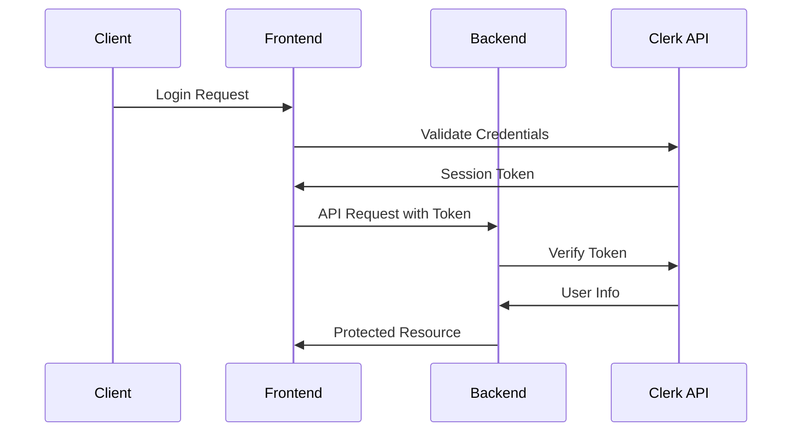

# API Reference Guide

**Version:** 1.0  
**Last Updated:** December 26, 2025  
**Status:** Active

---

## Overview

Complete API reference for Syntra's backend services, covering authentication, threads, collaboration, providers, and administrative endpoints. All endpoints support JSON request/response format with comprehensive error handling.

## Table of Contents

- [Authentication](#authentication)
- [Core Chat API](#core-chat-api)
- [Collaboration API](#collaboration-api)
- [Provider Management](#provider-management)
- [Administrative API](#administrative-api)
- [WebSocket/Streaming](#websocketstreaming)
- [Error Handling](#error-handling)

---

## Authentication

### Headers

All protected endpoints require authentication via Clerk session token:

```http
Authorization: Bearer <clerk_session_token>
X-Org-ID: <organization_id>
Content-Type: application/json
```

### Authentication Flow



---

## Core Chat API

### Threads Management

#### Create Thread

```http
POST /api/threads
Authorization: Bearer <token>
X-Org-ID: <org_id>
Content-Type: application/json
```

**Request Body:**
```json
{
  "title": "New Conversation",
  "initial_message": "Hello, I need help with...",
  "metadata": {
    "source": "web",
    "priority": "normal"
  }
}
```

**Response:**
```json
{
  "id": "thread_abc123",
  "title": "New Conversation", 
  "created_at": "2025-12-26T10:00:00Z",
  "updated_at": "2025-12-26T10:00:00Z",
  "message_count": 1,
  "metadata": {
    "source": "web",
    "priority": "normal"
  }
}
```

#### Get Thread

```http
GET /api/threads/{thread_id}
Authorization: Bearer <token>
X-Org-ID: <org_id>
```

**Response:**
```json
{
  "id": "thread_abc123",
  "title": "New Conversation",
  "created_at": "2025-12-26T10:00:00Z",
  "updated_at": "2025-12-26T10:00:00Z",
  "message_count": 5,
  "last_message_at": "2025-12-26T10:15:00Z",
  "metadata": {
    "source": "web",
    "priority": "normal"
  }
}
```

#### List Threads

```http
GET /api/threads?limit=20&offset=0&order=desc
Authorization: Bearer <token>
X-Org-ID: <org_id>
```

**Query Parameters:**
- `limit`: Number of threads to return (default: 20, max: 100)
- `offset`: Number of threads to skip (default: 0)
- `order`: Sort order - `desc` or `asc` (default: desc)
- `search`: Search in thread titles and messages

**Response:**
```json
{
  "threads": [
    {
      "id": "thread_abc123",
      "title": "Python Help",
      "created_at": "2025-12-26T10:00:00Z",
      "updated_at": "2025-12-26T10:15:00Z",
      "message_count": 8,
      "last_message_preview": "Great! That solved my problem..."
    }
  ],
  "total": 45,
  "limit": 20,
  "offset": 0,
  "has_more": true
}
```

### Messages

#### Send Message (Non-Streaming)

```http
POST /api/threads/{thread_id}/messages
Authorization: Bearer <token>
X-Org-ID: <org_id>
Content-Type: application/json
```

**Request Body:**
```json
{
  "content": "How do I implement authentication?",
  "role": "user",
  "attachments": [
    {
      "type": "image",
      "url": "https://example.com/screenshot.png",
      "description": "Screenshot of current login form"
    }
  ],
  "provider_preference": "openai",
  "model_preference": "gpt-4o",
  "metadata": {
    "source": "web",
    "priority": "normal"
  }
}
```

**Response:**
```json
{
  "id": "msg_def456",
  "thread_id": "thread_abc123", 
  "role": "assistant",
  "content": "Here's how to implement authentication...",
  "provider_used": "openai",
  "model_used": "gpt-4o",
  "routing_reason": "Code help query, high quality model selected",
  "tokens_used": 1250,
  "execution_time_ms": 2300,
  "created_at": "2025-12-26T10:05:00Z",
  "metadata": {
    "thinking_time_ms": 150,
    "generation_time_ms": 2150,
    "cost_estimate": 0.00312
  }
}
```

#### Send Message (Streaming)

```http
POST /api/threads/{thread_id}/messages/stream
Authorization: Bearer <token>
X-Org-ID: <org_id>
Content-Type: application/json
```

**Request Body:** Same as non-streaming endpoint

**Response:** Server-Sent Events stream

```
data: {"type": "thinking", "content": "Analyzing your question..."}

data: {"type": "routing", "provider": "openai", "model": "gpt-4o", "reason": "Code help requires high-quality model"}

data: {"type": "content", "delta": "Here's how to implement"}

data: {"type": "content", "delta": " authentication in your"}

data: {"type": "content", "delta": " application:\n\n1. Choose"}

data: {"type": "done", "message_id": "msg_def456", "tokens_used": 1250, "execution_time_ms": 2300}
```

#### Get Messages

```http
GET /api/threads/{thread_id}/messages?limit=50&before=msg_xyz789
Authorization: Bearer <token>
X-Org-ID: <org_id>
```

**Query Parameters:**
- `limit`: Number of messages (default: 50, max: 100)
- `before`: Get messages before this message ID
- `after`: Get messages after this message ID
- `include_metadata`: Include detailed metadata (default: false)

**Response:**
```json
{
  "messages": [
    {
      "id": "msg_def456",
      "thread_id": "thread_abc123",
      "role": "user", 
      "content": "How do I implement authentication?",
      "created_at": "2025-12-26T10:00:00Z",
      "attachments": []
    },
    {
      "id": "msg_ghi789",
      "thread_id": "thread_abc123", 
      "role": "assistant",
      "content": "Here's how to implement authentication...",
      "provider_used": "openai",
      "model_used": "gpt-4o",
      "tokens_used": 1250,
      "created_at": "2025-12-26T10:05:00Z"
    }
  ],
  "has_more": false,
  "total": 8
}
```

---

## Collaboration API

### Dynamic Collaboration

#### Start Dynamic Collaboration

```http
POST /api/collaborate/dynamic
Authorization: Bearer <token>
X-Org-ID: <org_id>
Content-Type: application/json
```

**Request Body:**
```json
{
  "message": "Design a microservices architecture for an e-commerce platform",
  "thread_id": "thread_abc123",
  "thread_context": "Previous discussion about scalability requirements",
  "settings": {
    "priority": "quality",
    "max_steps": 5
  }
}
```

**Response:**
```json
{
  "turn_id": "collab_xyz789",
  "final_answer": "Here's a comprehensive microservices architecture...",
  "plan": {
    "pipeline_summary": "5-step collaboration: Analysis → Research → Creation → Critique → Synthesis",
    "steps": [
      {
        "step_index": 0,
        "role": "analyst",
        "model_id": "openai:gpt-4o",
        "purpose": "Analyze requirements and constraints",
        "estimated_importance": 0.9
      },
      {
        "step_index": 1, 
        "role": "researcher",
        "model_id": "perplexity:sonar-pro",
        "purpose": "Research best practices and patterns",
        "needs_previous_steps": ["analyst"],
        "estimated_importance": 0.8
      }
    ],
    "planning_time_ms": 450
  },
  "step_results": [
    {
      "step_index": 0,
      "role": "analyst", 
      "model_id": "openai:gpt-4o",
      "model_name": "GPT-4o",
      "purpose": "Analyze requirements",
      "content": "Based on your requirements...",
      "execution_time_ms": 2100,
      "success": true
    }
  ],
  "total_time_ms": 15400,
  "available_models_used": ["openai:gpt-4o", "perplexity:sonar-pro", "gemini:gemini-2.5-pro"]
}
```

#### Dynamic Collaboration Stream

```http
POST /api/collaborate/dynamic/stream
Authorization: Bearer <token>
X-Org-ID: <org_id>
Content-Type: application/json
```

**Request Body:** Same as dynamic collaboration

**Response:** Server-Sent Events stream

```
data: {"type": "planning", "message": "Creating collaboration plan..."}

data: {"type": "plan_created", "plan": {"pipeline_summary": "5-step collaboration", "steps": [...], "planning_time_ms": 450}}

data: {"type": "step_started", "step_index": 0, "role": "analyst", "model_id": "openai:gpt-4o"}

data: {"type": "step_completed", "step_index": 0, "role": "analyst", "content": "Requirements analysis complete...", "execution_time_ms": 2100, "success": true}

data: {"type": "step_started", "step_index": 1, "role": "researcher", "model_id": "perplexity:sonar-pro"}

data: {"type": "final_answer", "turn_id": "collab_xyz789", "content": "Here's the comprehensive architecture..."}

data: {"type": "done"}
```

### Enhanced Collaboration

#### Enhanced Collaboration with External Review

```http
POST /api/collaborate/enhanced
Authorization: Bearer <token>
X-Org-ID: <org_id>
Content-Type: application/json
```

**Request Body:**
```json
{
  "message": "Explain the implications of quantum computing on current cryptography",
  "conversation_id": "thread_abc123",
  "enable_external_review": true,
  "review_mode": "high_fidelity"
}
```

**Response:**
```json
{
  "collab_run": {
    "id": "run_enhanced_123",
    "conversation_id": "thread_abc123",
    "status": "completed",
    "total_time_ms": 28500
  },
  "internal_report": "Initial analysis of quantum computing impact...",
  "compressed_report": "Quantum computing poses significant challenges...",
  "external_critiques": [
    {
      "reviewer": "Factual Expert",
      "provider": "perplexity",
      "model": "sonar-pro",
      "critique": "The analysis correctly identifies post-quantum cryptography...",
      "status": "success"
    },
    {
      "reviewer": "Technical Depth",
      "provider": "kimi", 
      "model": "kimi-k2-turbo-preview",
      "critique": "Consider adding details about lattice-based cryptography...",
      "status": "success"
    }
  ],
  "final_answer": "Quantum computing represents a paradigm shift...",
  "synthesis_metadata": {
    "synthesis_type": "moderate_integration",
    "primary_improvement": "technical_depth_added",
    "confidence_level": "high",
    "synthesis_status": "success",
    "analysis_available": true
  },
  "external_review_conducted": true,
  "reviewers_consulted": 3,
  "total_time_ms": 28500
}
```

### Council System

#### Multi-Agent Council

```http
POST /api/council/collaborate
Authorization: Bearer <token>
X-Org-ID: <org_id>
Content-Type: application/json
```

**Request Body:**
```json
{
  "query": "Create a production-ready Python FastAPI microservice with POST /v1/leads endpoint, GET /health, SQLite persistence, idempotency support. Output exactly three files: app/main.py, app/db.py, README.md",
  "output_mode": "deliverable-ownership",
  "context_pack": {
    "project_type": "microservice",
    "language": "python",
    "framework": "fastapi"
  },
  "transparency_mode": false
}
```

**Response:**
```json
{
  "status": "success",
  "output": "# Lead Ingestion Microservice\n\n## Final Deliverable\n\n### `app/main.py`\n```python\n# Owner: Architect\n# Reviewers: Data Engineer, Red Teamer\n# Purpose: FastAPI endpoints and request validation\n\nfrom fastapi import FastAPI, HTTPException\n...\n```\n\n### `app/db.py`\n```python\n# Owner: Data Engineer\n# Reviewers: Optimizer, Red Teamer  \n# Purpose: SQLAlchemy models and idempotency\n\nfrom sqlalchemy import create_engine\n...\n```\n\n### `README.md`\n```markdown\n# Lead Ingestion Service\n...\n```\n\n## Ownership & Provenance\n| File | Owner | Reviewers | Purpose |\n|------|-------|-----------|----------|\n| app/main.py | Architect | Data Engineer, Red Teamer | FastAPI endpoints |\n| app/db.py | Data Engineer | Optimizer, Red Teamer | Database layer |\n| README.md | Researcher | Architect, Optimizer | Documentation |\n\n## Judge Verdict\n**VERDICT: APPROVED ✅**\n\n**File Count Check:** 3 requested, 3 delivered ✅",
  "execution_time_ms": 23400,
  "phase": null,
  "phase1_outputs": {
    "architect": ["Requirements analysis complete...", "openai"],
    "data_engineer": ["Schema design finished...", "gemini"],
    "researcher": ["Dependencies research complete...", "perplexity"],
    "red_teamer": ["Security analysis complete...", "openai"],
    "optimizer": ["Optimization review complete...", "gemini"]
  }
}
```

---

## Provider Management

### API Keys

#### Add Provider API Key

```http
POST /api/orgs/{org_id}/provider-keys
Authorization: Bearer <token>
X-Org-ID: <org_id>
Content-Type: application/json
```

**Request Body:**
```json
{
  "provider": "openai",
  "api_key": "sk-proj-abc123...",
  "is_active": true,
  "description": "Production OpenAI key"
}
```

**Response:**
```json
{
  "id": 1,
  "provider": "openai",
  "is_active": true,
  "description": "Production OpenAI key",
  "created_at": "2025-12-26T10:00:00Z",
  "masked_key": "sk-proj-abc123...***"
}
```

#### List Provider Keys

```http
GET /api/orgs/{org_id}/provider-keys
Authorization: Bearer <token>
X-Org-ID: <org_id>
```

**Response:**
```json
{
  "provider_keys": [
    {
      "id": 1,
      "provider": "openai", 
      "is_active": true,
      "description": "Production OpenAI key",
      "created_at": "2025-12-26T10:00:00Z",
      "masked_key": "sk-proj-abc123...***"
    },
    {
      "id": 2,
      "provider": "gemini",
      "is_active": true, 
      "description": "Google Gemini API key",
      "created_at": "2025-12-26T09:30:00Z",
      "masked_key": "AIzaSy...***"
    }
  ],
  "total": 5
}
```

#### Update Provider Key

```http
PUT /api/orgs/{org_id}/provider-keys/{key_id}
Authorization: Bearer <token>
X-Org-ID: <org_id>
Content-Type: application/json
```

**Request Body:**
```json
{
  "is_active": false,
  "description": "Deprecated key - replaced with new one"
}
```

#### Delete Provider Key

```http
DELETE /api/orgs/{org_id}/provider-keys/{key_id}
Authorization: Bearer <token>
X-Org-ID: <org_id>
```

**Response:**
```json
{
  "message": "Provider key deleted successfully",
  "deleted_key_id": 1
}
```

### Available Models

#### List Available Models

```http
GET /api/collaborate/models
Authorization: Bearer <token>
X-Org-ID: <org_id>
```

**Response:**
```json
{
  "models": [
    {
      "id": "openai:gpt-4o",
      "display_name": "GPT-4o (OpenAI)",
      "provider": "openai",
      "model_name": "gpt-4o",
      "strengths": {
        "reasoning": 0.95,
        "creativity": 0.85,
        "factuality": 0.90,
        "code": 0.95,
        "long_context": 0.80
      },
      "cost_tier": "high",
      "has_browse": false,
      "relative_latency": 0.6,
      "max_context_tokens": 128000,
      "description": "Advanced reasoning and code generation"
    },
    {
      "id": "gemini:gemini-2.5-flash",
      "display_name": "Gemini 2.5 Flash",
      "provider": "gemini", 
      "model_name": "gemini-2.5-flash",
      "strengths": {
        "reasoning": 0.75,
        "creativity": 0.80,
        "factuality": 0.85,
        "code": 0.70,
        "long_context": 0.95
      },
      "cost_tier": "low",
      "has_browse": false,
      "relative_latency": 0.2,
      "max_context_tokens": 1048576,
      "description": "Fast, cost-effective model with excellent context"
    }
  ],
  "total_count": 12
}
```

---

## Administrative API

### Organization Management

#### Get Organization Info

```http
GET /api/orgs/{org_id}
Authorization: Bearer <token>
X-Org-ID: <org_id>
```

**Response:**
```json
{
  "id": "org_abc123",
  "name": "Acme Corporation",
  "plan": "enterprise",
  "usage_limits": {
    "requests_per_day": 10000,
    "tokens_per_day": 1000000,
    "collaborative_requests_per_day": 500
  },
  "current_usage": {
    "requests_today": 1250,
    "tokens_today": 125000,
    "collaborative_requests_today": 45
  },
  "features": {
    "collaboration_enabled": true,
    "enhanced_collaboration": true,
    "council_system": true,
    "external_review": true
  },
  "created_at": "2025-01-15T09:00:00Z"
}
```

### Analytics & Usage

#### Get Usage Analytics

```http
GET /api/analytics/usage?period=7d&granularity=day
Authorization: Bearer <token>
X-Org-ID: <org_id>
```

**Query Parameters:**
- `period`: `1d`, `7d`, `30d`, `90d`
- `granularity`: `hour`, `day`, `week`
- `provider`: Filter by specific provider
- `feature`: Filter by feature (chat, collaboration, council)

**Response:**
```json
{
  "period": "7d",
  "granularity": "day",
  "data": [
    {
      "date": "2025-12-20",
      "requests": 245,
      "tokens": 28500,
      "cost_estimate": 4.25,
      "collaboration_requests": 12,
      "average_response_time_ms": 2300
    },
    {
      "date": "2025-12-21", 
      "requests": 298,
      "tokens": 34200,
      "cost_estimate": 5.10,
      "collaboration_requests": 18,
      "average_response_time_ms": 2100
    }
  ],
  "summary": {
    "total_requests": 1847,
    "total_tokens": 218400,
    "total_cost_estimate": 32.85,
    "avg_requests_per_day": 264,
    "most_used_provider": "openai",
    "collaboration_usage_percent": 15.2
  }
}
```

#### Get Cost Breakdown

```http
GET /api/analytics/costs?period=30d&group_by=provider
Authorization: Bearer <token>
X-Org-ID: <org_id>
```

**Response:**
```json
{
  "period": "30d",
  "total_cost_estimate": 142.85,
  "breakdown": [
    {
      "provider": "openai",
      "models": {
        "gpt-4o": {"requests": 245, "tokens": 385000, "cost": 96.25},
        "gpt-4o-mini": {"requests": 892, "tokens": 124000, "cost": 18.60},
        "o1-mini": {"requests": 12, "tokens": 45000, "cost": 13.50}
      },
      "total_cost": 128.35
    },
    {
      "provider": "gemini", 
      "models": {
        "gemini-2.5-flash": {"requests": 456, "tokens": 98000, "cost": 7.35},
        "gemini-2.5-pro": {"requests": 34, "tokens": 56000, "cost": 7.00}
      },
      "total_cost": 14.35
    }
  ]
}
```

### Health & Status

#### System Health Check

```http
GET /api/health
```

**Response:**
```json
{
  "status": "healthy",
  "timestamp": "2025-12-26T10:00:00Z",
  "version": "1.0.0",
  "services": {
    "database": {"status": "healthy", "response_time_ms": 15},
    "redis": {"status": "healthy", "response_time_ms": 8}, 
    "qdrant": {"status": "healthy", "response_time_ms": 25}
  },
  "providers": {
    "openai": {"status": "healthy", "last_check": "2025-12-26T09:59:00Z"},
    "gemini": {"status": "healthy", "last_check": "2025-12-26T09:59:00Z"},
    "perplexity": {"status": "healthy", "last_check": "2025-12-26T09:59:00Z"}
  }
}
```

---

## WebSocket/Streaming

### Server-Sent Events

All streaming endpoints use Server-Sent Events (SSE) with the following event types:

**Event Types:**
- `thinking`: Model is analyzing the query
- `routing`: Provider/model selection information
- `content`: Incremental response content
- `planning`: Collaboration planning in progress
- `plan_created`: Collaboration plan has been created
- `step_started`: Collaboration step has started
- `step_completed`: Collaboration step has finished
- `final_answer`: Final response content
- `error`: Error occurred during processing
- `done`: Stream completed successfully

**Event Format:**
```
data: {"type": "content", "delta": "Hello", "metadata": {"tokens": 1}}

data: {"type": "done", "message_id": "msg_abc123", "total_tokens": 150}
```

### Streaming Best Practices

**Client Implementation:**
```javascript
const eventSource = new EventSource('/api/threads/123/messages/stream', {
  headers: {
    'Authorization': 'Bearer ' + token,
    'X-Org-ID': orgId
  }
});

eventSource.onmessage = (event) => {
  const data = JSON.parse(event.data);
  handleStreamEvent(data);
};

eventSource.onerror = (error) => {
  console.error('Stream error:', error);
  eventSource.close();
};
```

**Error Handling:**
- Implement exponential backoff for reconnections
- Handle network timeouts gracefully
- Parse JSON safely with error handling
- Close connections properly on page unload

---

## Error Handling

### Error Response Format

All API errors follow this consistent format:

```json
{
  "error": {
    "code": "INVALID_REQUEST",
    "message": "The request is missing required parameters",
    "details": {
      "missing_fields": ["content", "role"],
      "request_id": "req_abc123",
      "timestamp": "2025-12-26T10:00:00Z"
    }
  }
}
```

### HTTP Status Codes

| Status | Code | Description |
|--------|------|-------------|
| 200 | OK | Request successful |
| 201 | Created | Resource created successfully |
| 400 | Bad Request | Invalid request parameters |
| 401 | Unauthorized | Invalid or missing authentication |
| 403 | Forbidden | Insufficient permissions |
| 404 | Not Found | Resource not found |
| 409 | Conflict | Resource conflict (duplicate, etc.) |
| 429 | Too Many Requests | Rate limit exceeded |
| 500 | Internal Server Error | Server error |
| 502 | Bad Gateway | Provider API error |
| 503 | Service Unavailable | Service temporarily unavailable |

### Error Codes

| Code | Description | Action |
|------|-------------|---------|
| `INVALID_REQUEST` | Malformed request | Check request format and required fields |
| `AUTHENTICATION_FAILED` | Invalid token | Re-authenticate with Clerk |
| `PERMISSION_DENIED` | Insufficient permissions | Check organization access |
| `RESOURCE_NOT_FOUND` | Requested resource doesn't exist | Verify resource ID |
| `RATE_LIMIT_EXCEEDED` | Too many requests | Implement backoff, check rate limits |
| `PROVIDER_ERROR` | External provider failed | Check provider status, try again |
| `VALIDATION_ERROR` | Input validation failed | Fix validation errors in request |
| `SYSTEM_ERROR` | Internal system error | Contact support if persists |

### Rate Limiting

**Headers:**
```http
X-RateLimit-Limit: 1000
X-RateLimit-Remaining: 999
X-RateLimit-Reset: 1640995200
X-RateLimit-Retry-After: 60
```

**Rate Limits:**
- Standard: 1000 requests/hour per organization
- Collaboration: 100 requests/hour per organization  
- Burst: Up to 50 requests/minute
- Token limits: Based on organization plan

---

This comprehensive API reference provides complete coverage of all Syntra backend endpoints with request/response examples, error handling, and best practices for integration.