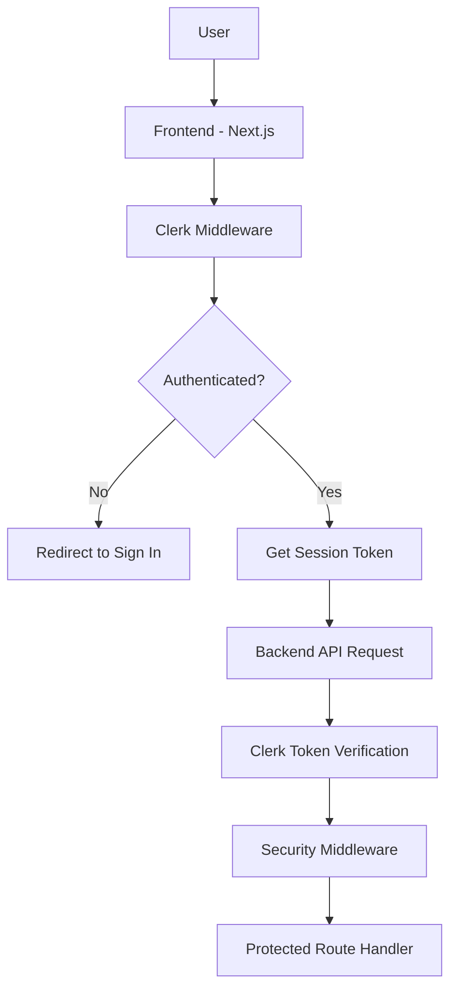

# Authentication & Security Architecture Guide

**Version:** 1.0  
**Last Updated:** December 26, 2025  
**Status:** Active

---

## Overview

Syntra implements a multi-layered security architecture with Clerk-based authentication, comprehensive security middleware, and enterprise-grade encryption. This guide covers authentication flows, security measures, and implementation details.

## Table of Contents

- [Authentication System](#authentication-system)
- [Security Middleware](#security-middleware)
- [API Key Management](#api-key-management)
- [Request Flow Security](#request-flow-security)
- [Production Security](#production-security)
- [Security Headers](#security-headers)
- [Implementation Details](#implementation-details)

---

## Authentication System

### Architecture Overview



### Frontend Authentication (Next.js + Clerk)

**File:** `frontend/middleware.ts`

```typescript
import { clerkMiddleware, createRouteMatcher } from "@clerk/nextjs/server";

const isPublicRoute = createRouteMatcher([
  "/",
  "/auth/sign-in(.*)",
  "/auth/sign-up(.*)",
  "/api(.*)",
]);

export default clerkMiddleware(async (auth, req) => {
  if (!isPublicRoute(req)) {
    await auth.protect();
  }
});
```

**Protected Routes:**
- All routes except `/`, `/auth/*`, `/api/*`
- Automatic redirect to sign-in for unauthenticated users
- Session token embedded in requests

**Public Routes:**
- Landing page (`/`)
- Authentication pages (`/auth/sign-in`, `/auth/sign-up`)
- API endpoints (protected separately)

### Backend Token Verification

**File:** `backend/app/services/clerk_client.py`

**Token Verification Flow:**

1. **Extract Token:** Get session token from request headers
2. **Cache Check:** Check 5-minute in-memory cache for verified tokens
3. **Clerk API Verification:** Verify token with Clerk's API
4. **User Data Extraction:** Get user profile from Clerk
5. **Cache Result:** Store verified payload for future requests

**Key Features:**
- **5-minute token cache** for performance
- **Automatic cache cleanup** (max 1000 entries)
- **Comprehensive error handling** with detailed logging
- **User profile enrichment** (email, name, verification status)

```python
async def verify_clerk_token(token: str) -> Optional[dict]:
    # Cache check
    if token in _token_cache:
        cached_payload, expiry = _token_cache[token]
        if current_time < expiry:
            return cached_payload
    
    # Verify with Clerk API
    async with httpx.AsyncClient() as client:
        response = await client.get(
            f"https://api.clerk.com/v1/users/{user_id}",
            headers={"Authorization": f"Bearer {settings.clerk_secret_key}"}
        )
    
    # Build decoded payload
    decoded_payload = {
        "uid": user_id,
        "email": user_data.get("email_addresses", [{}])[0].get("email_address"),
        "name": user_data.get("first_name", "") + " " + user_data.get("last_name", ""),
        "email_verified": user_data.get("email_addresses", [{}])[0].get("verification", {}).get("status") == "verified"
    }
```

---

## Security Middleware

### Security Headers Middleware

**File:** `backend/app/core/security_middleware.py`

**Applied Security Headers:**

```python
response.headers["X-Content-Type-Options"] = "nosniff"
response.headers["X-Frame-Options"] = "DENY"
response.headers["X-XSS-Protection"] = "1; mode=block"
response.headers["Referrer-Policy"] = "strict-origin-when-cross-origin"
response.headers["Permissions-Policy"] = "geolocation=(), microphone=(), camera=()"
```

**Content Security Policy:**
```
default-src 'self'; 
script-src 'self' 'unsafe-inline'; 
style-src 'self' 'unsafe-inline'; 
img-src 'self' data: https:; 
font-src 'self'; 
connect-src 'self' https://api.openai.com https://api.anthropic.com https://generativelanguage.googleapis.com https://openrouter.ai
```

**Production-Only Headers:**
```python
# HSTS (only in production)
if os.getenv("ENVIRONMENT") == "production":
    response.headers["Strict-Transport-Security"] = "max-age=31536000; includeSubDomains"
```

### CORS Configuration

**Development Environment:**
- `allow_origins=["*"]` for development flexibility
- All methods and headers allowed

**Production Environment:**
- Strict origin validation from `ALLOWED_ORIGINS` environment variable
- Limited methods: `["GET", "POST", "PUT", "PATCH", "DELETE", "OPTIONS"]`
- Limited headers: `["Authorization", "Content-Type", "X-Request-ID"]`
- 10-minute preflight cache

---

## API Key Management

### Encrypted Storage

**Encryption System:**
- **Algorithm:** Fernet symmetric encryption
- **Key Source:** `ENCRYPTION_KEY` environment variable
- **Storage:** Encrypted in PostgreSQL database
- **Decryption:** On-demand for API calls

**Key Management Flow:**

```python
# Encryption (when storing)
from cryptography.fernet import Fernet

def encrypt_api_key(key: str) -> str:
    f = Fernet(settings.encryption_key)
    return f.encrypt(key.encode()).decode()

# Decryption (when using)
def decrypt_api_key(encrypted_key: str) -> str:
    f = Fernet(settings.encryption_key)
    return f.decrypt(encrypted_key.encode()).decode()
```

### Multi-Tenant Isolation

**Organization-Level Keys:**
- Each organization has separate API key storage
- Row-Level Security (RLS) enforces data isolation
- Keys are never shared between organizations

**Provider Key Model:**
```python
class ProviderKey(Base):
    __tablename__ = "provider_keys"
    
    id: Mapped[int] = mapped_column(primary_key=True)
    org_id: Mapped[str] = mapped_column(String, nullable=False)
    provider: Mapped[ProviderType] = mapped_column(Enum(ProviderType), nullable=False)
    encrypted_key: Mapped[str] = mapped_column(Text, nullable=False)
    is_active: Mapped[bool] = mapped_column(Boolean, default=True)
    created_at: Mapped[datetime] = mapped_column(DateTime, default=datetime.utcnow)
```

### Key Rotation

**Rotation Process:**
1. Add new key with `is_active=True`
2. Set old key to `is_active=False`
3. System automatically uses active keys
4. Clean up old keys after grace period

---

## Request Flow Security

### Authentication Flow

```
1. Frontend Request → Clerk Session Token
2. Backend Receives → Extract Token from Headers
3. Token Verification → Clerk API Validation
4. User Context → Populate org_id, user_id
5. Authorization Check → Verify access permissions
6. Route Handler → Process request with user context
```

### Security Validation Points

**1. Input Validation:**
- Pydantic models for request validation
- SQL injection prevention via parameterized queries
- XSS prevention via content sanitization

**2. Authorization:**
- Organization-level access control
- Role-based permissions (future enhancement)
- Resource-level access validation

**3. Rate Limiting:**
- Per-organization rate limits
- Provider-specific rate limiting
- Burst protection

**4. Audit Logging:**
- All authentication events
- API key usage tracking
- Failed authentication attempts
- Sensitive operation logging

---

## Production Security

### Environment Configuration

**Required Environment Variables:**
```bash
# Authentication
CLERK_SECRET_KEY=sk_test_...

# Encryption
ENCRYPTION_KEY=base64_encoded_key
SECRET_KEY=secure_random_string

# Security
ENVIRONMENT=production
ALLOWED_ORIGINS=https://yourdomain.com,https://app.yourdomain.com

# Database
DATABASE_URL=postgresql+asyncpg://...
```

### Security Checklist

**✅ Authentication:**
- [x] Clerk integration with token verification
- [x] Session token caching
- [x] Automatic token expiration
- [x] Secure cookie settings

**✅ Data Protection:**
- [x] API key encryption at rest
- [x] HTTPS enforcement in production
- [x] Secure environment variable management
- [x] AWS Parameter Store integration

**✅ Network Security:**
- [x] CORS configuration
- [x] Security headers implementation
- [x] CSP policy enforcement
- [x] HSTS in production

**✅ Application Security:**
- [x] Input validation
- [x] SQL injection prevention
- [x] XSS protection
- [x] Rate limiting

### Monitoring & Alerting

**Security Metrics:**
- Failed authentication attempts
- Unusual API key usage patterns
- Rate limit violations
- Security header violations

**Recommended Alerts:**
- Multiple failed auth attempts from same IP
- API key usage from unexpected locations
- Unusual provider API errors
- Security middleware failures

---

## Security Headers

### Implemented Headers

| Header | Value | Purpose |
|--------|--------|---------|
| `X-Content-Type-Options` | `nosniff` | Prevent MIME sniffing attacks |
| `X-Frame-Options` | `DENY` | Prevent clickjacking |
| `X-XSS-Protection` | `1; mode=block` | Enable XSS filtering |
| `Referrer-Policy` | `strict-origin-when-cross-origin` | Control referrer information |
| `Permissions-Policy` | `geolocation=(), microphone=(), camera=()` | Disable unnecessary permissions |
| `Content-Security-Policy` | (See above) | Control resource loading |
| `Strict-Transport-Security` | `max-age=31536000; includeSubDomains` | Force HTTPS (production only) |

### Header Bypass for Development

**Swagger UI Exception:**
- CSP headers relaxed for `/docs` endpoints
- Allows Swagger UI to function properly
- Only applies to API documentation pages

---

## Implementation Details

### Frontend Components

**Auth Provider:** `frontend/components/auth/auth-provider.tsx`
- Wraps app with Clerk authentication
- Provides user context throughout application
- Handles authentication state management

**Protected Pages:**
- All pages under `/conversations/*`
- Settings and dashboard pages
- Automatic redirect to sign-in when unauthenticated

### Backend Dependencies

**Authentication:**
- `python-jose` for JWT handling
- `httpx` for Clerk API communication
- `cryptography` for key encryption

**Security:**
- `FastAPI` built-in security features
- `SQLAlchemy` for safe database queries
- Custom middleware for headers and CORS

### Database Schema

**Users Table:**
```sql
CREATE TABLE users (
    id UUID PRIMARY KEY DEFAULT gen_random_uuid(),
    clerk_user_id VARCHAR UNIQUE NOT NULL,
    email VARCHAR NOT NULL,
    name VARCHAR,
    created_at TIMESTAMP DEFAULT NOW(),
    updated_at TIMESTAMP DEFAULT NOW()
);
```

**Provider Keys Table:**
```sql
CREATE TABLE provider_keys (
    id SERIAL PRIMARY KEY,
    org_id VARCHAR NOT NULL,
    provider VARCHAR NOT NULL,
    encrypted_key TEXT NOT NULL,
    is_active BOOLEAN DEFAULT TRUE,
    created_at TIMESTAMP DEFAULT NOW()
);
```

### Error Handling

**Authentication Errors:**
- Invalid tokens return 401 Unauthorized
- Expired tokens trigger re-authentication
- Network errors fallback gracefully

**Security Errors:**
- CSP violations logged but not blocked
- Rate limit violations return 429 Too Many Requests
- Encryption errors trigger alert and fallback

---

## Best Practices

### Development

1. **Never commit secrets** to version control
2. **Use environment variables** for all sensitive configuration
3. **Test authentication flows** in development environment
4. **Validate CORS settings** before production deployment

### Production

1. **Rotate encryption keys** regularly
2. **Monitor authentication metrics** continuously
3. **Keep security dependencies** updated
4. **Review security logs** regularly

### Security Review

1. **Regular security audits** of authentication flow
2. **Penetration testing** of authentication endpoints
3. **Code review** of security-sensitive changes
4. **Compliance validation** against security standards

---

## Troubleshooting

### Common Issues

**Authentication Failures:**
- Check `CLERK_SECRET_KEY` configuration
- Verify network connectivity to Clerk API
- Check token cache size and expiration
- Validate frontend Clerk configuration

**CORS Errors:**
- Verify `ALLOWED_ORIGINS` in production
- Check request origin matches allowed list
- Ensure preflight requests include proper headers
- Validate CORS middleware configuration

**Encryption Issues:**
- Verify `ENCRYPTION_KEY` is properly base64 encoded
- Check key rotation procedures
- Validate database encryption column types
- Test key decryption in isolated environment

### Debug Commands

```bash
# Test Clerk token verification
curl -H "Authorization: Bearer <token>" http://localhost:8000/api/auth/verify

# Check security headers
curl -I http://localhost:8000/api/health

# Validate CORS
curl -H "Origin: https://example.com" -H "Access-Control-Request-Method: POST" -X OPTIONS http://localhost:8000/api/

# Test API key encryption
python -c "from app.services.provider_keys import encrypt_api_key; print(encrypt_api_key('test_key'))"
```

---

This authentication and security guide provides comprehensive coverage of Syntra's security architecture, from frontend authentication to backend encryption and production hardening.