# Collaboration Features Implementation Guide

**Version:** 1.0  
**Last Updated:** December 26, 2025  
**Status:** Active

---

## Overview

Syntra implements advanced AI collaboration features including multi-agent council orchestration, dynamic collaboration workflows, and real-time streaming collaboration. This guide covers the complete implementation of collaboration features from backend orchestration to frontend user experience.

## Table of Contents

- [Multi-Agent Council System](#multi-agent-council-system)
- [Dynamic Collaboration Engine](#dynamic-collaboration-engine)
- [Frontend Collaboration Interface](#frontend-collaboration-interface)
- [Real-Time Streaming](#real-time-streaming)
- [Collaboration Workflows](#collaboration-workflows)
- [External Review System](#external-review-system)
- [Implementation Details](#implementation-details)

---

## Multi-Agent Council System

### Architecture Overview

The Multi-Agent Council orchestrates five specialized AI agents to collaboratively solve complex problems through a three-phase workflow:

```mermaid
flowchart TD
    A[User Query] --> B[Phase 1: Parallel Agent Execution]
    B --> C[Architect Agent 🤖]
    B --> D[Data Engineer Agent 🌌]
    B --> E[Researcher Agent 🦅]
    B --> F[Red Teamer Agent 🚀]
    B --> G[Optimizer Agent 🌙]
    
    C --> H[Phase 2: Debate Synthesizer]
    D --> H
    E --> H
    F --> H
    G --> H
    
    H --> I[Phase 3: Judge Agent]
    I --> J[Final Deliverable with Provenance]
```



### Agent Specializations

**File:** `backend/app/services/council/orchestrator.py`

| Agent | Role | Ownership | Output Focus |
|-------|------|-----------|--------------|
| **Architect** 🤖 | Lead/PM, structural thinking | Requirements, API design, file structure | Architecture decisions, file plans |
| **Data Engineer** 🌌 | Analytical, scale-focused | Database schema, idempotency, indexing | Schema design, data strategies |
| **Researcher** 🦅 | Evidence-driven, meticulous | Dependencies, best practices, docs | Recommendations, compatibility |
| **Red Teamer** 🚀 | Security-focused, contrarian | Threat modeling, edge cases, privacy | Security checklist, threat models |
| **Optimizer** 🌙 | Simplicity-focused, humble | Code optimization, DRY, bloat removal | Performance, simplification |

### Three-Phase Execution

**Phase 1: Parallel Execution (5-15 seconds)**
```python
async def phase_1_parallel_agents(query: str):
    architect_task = run_agent(ARCHITECT_PROMPT, query)
    data_eng_task = run_agent(DATA_ENGINEER_PROMPT, query)
    researcher_task = run_agent(RESEARCHER_PROMPT, query)
    red_team_task = run_agent(RED_TEAMER_PROMPT, query)
    optimizer_task = run_agent(OPTIMIZER_PROMPT, query)

    # Run all simultaneously, wait for all to complete
    results = await asyncio.gather(
        architect_task,
        data_eng_task,
        researcher_task,
        red_team_task,
        optimizer_task
    )
    
    return agent_outputs
```

**Phase 2: Synthesis (3-5 seconds)**
- Merges all five agent outputs into coherent plan
- Resolves conflicts with explicit decisions
- Creates ownership map and provenance headers
- Validates hard requirements compliance

**Phase 3: Judge Validation (5-10 seconds)**
- Produces final deliverable with runnable code
- Issues binding verdict (APPROVED ✅ / NEEDS REVISION ⚠️)
- Ensures all hard requirements met
- Provides complete provenance and risk assessment

### Output Modes

| Mode | Contents | Use Case |
|------|----------|----------|
| `deliverable-only` | Final code/solution only | CI/CD pipelines, automation |
| `deliverable-ownership` | Code + ownership + checklist | Team collaboration (default) |
| `audit` | Above + risk register + decisions | Compliance, high-risk features |
| `full-transcript` | Above + complete agent debate | Learning, documentation |

---

## Dynamic Collaboration Engine

### Adaptive Multi-Agent Pipeline

**File:** `backend/app/services/dynamic_orchestrator.py`

The dynamic collaboration system automatically creates optimal agent pipelines based on query complexity:

```python
class DynamicOrchestrator:
    async def create_collaboration_plan(
        self,
        query: str,
        settings: UserSettings
    ) -> CollaborationPlan:
        
        # Analyze query to determine optimal collaboration strategy
        complexity = await self._analyze_query_complexity(query)
        
        # Select agents based on query needs
        selected_agents = self._select_agents_for_complexity(complexity)
        
        # Create execution steps with dependencies
        steps = []
        for i, agent_role in enumerate(selected_agents):
            model_id = self._select_model_for_role(agent_role, settings.priority)
            
            steps.append(CollabStep(
                step_index=i,
                role=agent_role,
                model_id=model_id,
                purpose=self._get_role_purpose(agent_role),
                needs_previous_steps=[j for j in range(i)]
            ))
        
        return CollaborationPlan(steps=steps, ...)
```

### Collaboration Roles

**TypeScript Types:** `frontend/lib/orchestrator-types.ts`

```typescript
type CollabRole = 'analyst' | 'researcher' | 'creator' | 'critic' | 'synthesizer'

const COLLAB_ROLE_DISPLAY = {
  analyst: {
    name: 'Analyst',
    description: 'Clarifies and decomposes the task',
    icon: '🔍'
  },
  researcher: {
    name: 'Researcher',
    description: 'Gathers facts and references', 
    icon: '📚'
  },
  creator: {
    name: 'Creator',
    description: 'Produces the draft solution',
    icon: '✨'
  },
  critic: {
    name: 'Critic',
    description: 'Evaluates and identifies issues',
    icon: '🎯'
  },
  synthesizer: {
    name: 'Synthesizer',
    description: 'Creates the final polished answer',
    icon: '🔮'
  }
}
```

### Model Selection Strategy

**Priority-Based Selection:**

| Priority | Strategy | Model Selection |
|----------|----------|----------------|
| `quality` | Best available models | GPT-4o, Gemini Pro, O1 |
| `balanced` | Cost-quality balance | GPT-4o-mini, Gemini Flash |
| `speed` | Fastest models | Gemini Flash, smaller models |
| `cost` | Cheapest capable | Gemini Flash, Kimi models |

### User Settings Interface

```typescript
interface UserSettings {
  priority: UserPriority          // 'quality' | 'balanced' | 'speed' | 'cost'
  max_steps: number              // 1-7 collaboration steps
}

// Frontend hook for dynamic collaboration
const { runWithStreaming, state } = useDynamicCollaboration({
  onPlanCreated: (plan) => console.log('Plan:', plan),
  onStepCompleted: (result) => console.log('Step:', result),
  onComplete: (response) => console.log('Final:', response)
});
```

---

## Frontend Collaboration Interface

### Real-Time Collaboration UI

**File:** `frontend/components/enhanced-chat-interface.tsx`

The frontend provides rich real-time visualization of collaboration progress:

```tsx
// Collaboration toggle component
const CollaborateToggle = ({ 
  enabled, 
  onToggle, 
  isLoading 
}: CollaborateToggleProps) => {
  return (
    <Button
      variant="outline"
      size="sm"
      onClick={onToggle}
      disabled={isLoading}
      className={cn(
        "gap-2 transition-all",
        enabled && "bg-blue-50 border-blue-200 text-blue-700"
      )}
    >
      <Users className="h-4 w-4" />
      {enabled ? "Collaborate" : "Standard"}
    </Button>
  );
};
```

### Collaboration Visualization Components

**Step Progress Display:**
```tsx
// Shows real-time progress through collaboration steps
const CollaborationProgress = ({ plan, currentStep, stepResults }) => {
  return (
    <div className="space-y-3">
      {plan.steps.map((step, index) => (
        <div key={index} className="flex items-center gap-3">
          <div className={cn(
            "w-8 h-8 rounded-full flex items-center justify-center text-sm font-medium",
            index < currentStep ? "bg-green-100 text-green-700" :
            index === currentStep ? "bg-blue-100 text-blue-700" :
            "bg-gray-100 text-gray-500"
          )}>
            {COLLAB_ROLE_DISPLAY[step.role].icon}
          </div>
          
          <div className="flex-1">
            <div className="font-medium">{COLLAB_ROLE_DISPLAY[step.role].name}</div>
            <div className="text-sm text-gray-600">{step.purpose}</div>
          </div>
          
          {stepResults[index] && (
            <div className="text-xs text-gray-500">
              {formatExecutionTime(stepResults[index].execution_time_ms)}
            </div>
          )}
        </div>
      ))}
    </div>
  );
};
```

**Thinking Strip Animation:**
```tsx
// Shows active collaboration status
const ThinkingStrip = ({ currentAgent, isVisible }) => {
  if (!isVisible) return null;
  
  return (
    <motion.div
      initial={{ opacity: 0, y: -20 }}
      animate={{ opacity: 1, y: 0 }}
      className="bg-blue-50 border-l-4 border-blue-400 p-4"
    >
      <div className="flex items-center gap-2">
        <Loader2 className="h-4 w-4 animate-spin text-blue-600" />
        <span className="text-blue-700 font-medium">
          {currentAgent} is working...
        </span>
      </div>
    </motion.div>
  );
};
```

### Collaboration Results Display

**Final Answer Card:**
```tsx
const FinalAnswerCard = ({ content, metadata, stepResults }) => {
  return (
    <Card className="border-green-200 bg-green-50/50">
      <CardHeader>
        <div className="flex items-center gap-2">
          <CheckCircle className="h-5 w-5 text-green-600" />
          <span className="font-semibold text-green-800">Final Answer</span>
          <Badge variant="secondary" className="ml-auto">
            {formatExecutionTime(metadata.total_time_ms)}
          </Badge>
        </div>
      </CardHeader>
      
      <CardContent>
        <div className="prose max-w-none">
          <ReactMarkdown>{content}</ReactMarkdown>
        </div>
        
        {/* Show collaboration attribution */}
        <CollaborationAttribution stepResults={stepResults} />
      </CardContent>
    </Card>
  );
};
```

---

## Real-Time Streaming

### Server-Sent Events Implementation

**Backend Streaming:** `backend/app/api/dynamic_collaborate.py`

```python
@router.post("/collaborate/stream")
async def collaborate_stream(
    request: DynamicCollaborateRequest,
    db: AsyncSession = Depends(get_db)
):
    async def event_generator():
        try:
            # Send planning event
            yield f"data: {json.dumps({'type': 'planning', 'message': 'Creating collaboration plan...'})}\n\n"
            
            # Create collaboration plan
            plan = await orchestrator.create_collaboration_plan(
                request.message, 
                request.settings or DEFAULT_COLLAB_SETTINGS
            )
            
            # Send plan created event
            yield f"data: {json.dumps({'type': 'plan_created', 'plan': plan.dict()})}\n\n"
            
            # Execute steps and stream results
            step_results = []
            for step in plan.steps:
                # Send step started event
                yield f"data: {json.dumps({'type': 'step_started', 'step_index': step.step_index, 'role': step.role})}\n\n"
                
                # Execute step
                result = await execute_collaboration_step(step, step_results)
                step_results.append(result)
                
                # Send step completed event
                yield f"data: {json.dumps({'type': 'step_completed', 'result': result.dict()})}\n\n"
            
            # Generate final answer
            final_answer = await synthesize_final_answer(step_results)
            
            # Send final answer event
            yield f"data: {json.dumps({'type': 'final_answer', 'content': final_answer})}\n\n"
            
            yield "data: {\"type\": \"done\"}\n\n"
            
        except Exception as e:
            yield f"data: {json.dumps({'type': 'error', 'message': str(e)})}\n\n"
    
    return StreamingResponse(
        event_generator(),
        media_type="text/plain",
        headers={"Cache-Control": "no-cache", "Connection": "keep-alive"}
    )
```

### Frontend Streaming Consumer

**React Hook:** `frontend/hooks/use-dynamic-collaboration.ts`

```typescript
export function useDynamicCollaboration(options: UseDynamicCollaborationOptions = {}) {
  const [state, setState] = useState<CollaborationState>({
    isRunning: false,
    isPlanning: false,
    currentStep: null,
    totalSteps: 0,
    plan: null,
    stepResults: [],
    finalAnswer: null,
    error: null,
    totalTimeMs: 0
  });
  
  const runWithStreaming = useCallback(async (
    message: string,
    threadId?: string,
    priority?: UserPriority
  ) => {
    const generator = runDynamicCollaborationStream(message, threadId, settings);
    
    for await (const event of generator) {
      switch (event.type) {
        case 'planning':
          setState(prev => ({ ...prev, isPlanning: true }));
          break;
          
        case 'plan_created':
          setState(prev => ({ 
            ...prev, 
            isPlanning: false,
            plan: event.plan,
            totalSteps: event.plan.steps.length
          }));
          options.onPlanCreated?.(event.plan);
          break;
          
        case 'step_started':
          setState(prev => ({ ...prev, currentStep: event.step_index }));
          options.onStepStarted?.(event.step_index, event.role);
          break;
          
        case 'step_completed':
          setState(prev => ({ 
            ...prev,
            stepResults: [...prev.stepResults, event.result]
          }));
          options.onStepCompleted?.(event.result);
          break;
          
        case 'final_answer':
          setState(prev => ({ 
            ...prev, 
            finalAnswer: event.content,
            isRunning: false
          }));
          break;
          
        case 'error':
          setState(prev => ({ ...prev, error: event.message, isRunning: false }));
          options.onError?.(event.message);
          break;
      }
    }
  }, [options, settings]);
  
  return { runWithStreaming, state, ...other_methods };
}
```

---

## Collaboration Workflows

### Standard Collaboration Flow

1. **User Input** - Message submitted with collaboration toggle enabled
2. **Query Analysis** - Determine complexity and optimal agent selection
3. **Plan Creation** - Generate step-by-step execution plan
4. **Agent Execution** - Sequential execution with dependency management
5. **Result Synthesis** - Combine agent outputs into final answer
6. **Provenance Tracking** - Track which agents contributed to final result

### Enhanced Collaboration with External Review

**File:** `backend/app/services/enhanced_collaboration_engine.py`

```python
class EnhancedCollaborationEngine:
    async def run_enhanced_collaboration(
        self,
        message: str,
        enable_external_review: bool = True,
        review_mode: str = 'auto'
    ) -> EnhancedCollaborateResponse:
        
        # Phase 1: Internal collaboration
        internal_result = await self.dynamic_orchestrator.collaborate(message)
        
        # Phase 2: External review (if enabled)
        external_reviews = []
        if enable_external_review:
            external_reviews = await self.external_reviewers.conduct_review(
                internal_result.final_answer,
                mode=review_mode
            )
        
        # Phase 3: Synthesis with external feedback
        if external_reviews:
            final_answer = await self.synthesize_with_external_feedback(
                internal_result.final_answer,
                external_reviews
            )
            synthesis_metadata = self._analyze_synthesis_impact(external_reviews)
        else:
            final_answer = internal_result.final_answer
            synthesis_metadata = None
        
        return EnhancedCollaborateResponse(
            internal_report=internal_result.final_answer,
            external_critiques=external_reviews,
            final_answer=final_answer,
            synthesis_metadata=synthesis_metadata,
            external_review_conducted=len(external_reviews) > 0,
            reviewers_consulted=len(external_reviews)
        )
```

---

## External Review System

### Multi-Model Council Review

The external review system leverages multiple AI models to critique and improve collaboration results:

**Review Process:**
1. **Automatic Triggering** - Based on confidence scores and query complexity
2. **Multi-Model Critique** - Deploy different models as specialized reviewers
3. **Synthesis Integration** - Incorporate feedback into final answer
4. **Confidence Assessment** - Track synthesis impact and confidence levels

### Reviewer Specializations

| Reviewer | Provider | Specialization | Focus Area |
|----------|----------|----------------|------------|
| Factual Expert | Perplexity | Fact-checking | Accuracy, citations |
| Perspective Analyst | Gemini | Alternative viewpoints | Bias, completeness |
| Clarity Specialist | OpenAI | Communication | Readability, structure |
| Technical Depth | Kimi | Deep analysis | Technical accuracy |

### Synthesis Metadata

```typescript
interface SynthesisMetadata {
  synthesis_type: 'minimal_changes' | 'moderate_integration' | 'major_revision' | 'uncertainty_highlighted'
  primary_improvement: 'factual_correction' | 'perspective_added' | 'clarity_enhanced' | 'uncertainty_noted'
  confidence_level: 'high' | 'medium' | 'low'
  synthesis_status: 'success' | 'failed'
  analysis_available: boolean
  fallback_used?: boolean
}
```

---

## Implementation Details

### Database Schema

**Collaboration Runs:**
```sql
CREATE TABLE collaboration_runs (
    id UUID PRIMARY KEY DEFAULT gen_random_uuid(),
    conversation_id UUID NOT NULL,
    user_id VARCHAR NOT NULL,
    query_text TEXT NOT NULL,
    collaboration_type VARCHAR NOT NULL,
    status VARCHAR NOT NULL,
    plan_data JSONB,
    step_results JSONB,
    final_answer TEXT,
    total_time_ms INTEGER,
    created_at TIMESTAMP DEFAULT NOW(),
    completed_at TIMESTAMP
);
```

**Step Execution Tracking:**
```sql
CREATE TABLE collaboration_steps (
    id UUID PRIMARY KEY DEFAULT gen_random_uuid(),
    collaboration_run_id UUID REFERENCES collaboration_runs(id),
    step_index INTEGER NOT NULL,
    role VARCHAR NOT NULL,
    model_id VARCHAR NOT NULL,
    purpose TEXT,
    content TEXT,
    execution_time_ms INTEGER,
    success BOOLEAN,
    error_message TEXT,
    created_at TIMESTAMP DEFAULT NOW()
);
```

### Configuration Management

**Environment Variables:**
```bash
# Collaboration Features
COLLABORATION_ENABLED=1
ENHANCED_COLLABORATION_ENABLED=1
EXTERNAL_REVIEW_ENABLED=1

# Council System
COUNCIL_OUTPUT_MODE=deliverable-ownership
COUNCIL_QUALITY_DIRECTIVE=1
COUNCIL_VALIDATION=1

# Model Selection
DEFAULT_COLLABORATION_PRIORITY=balanced
MAX_COLLABORATION_STEPS=7
```

### Performance Optimization

**Parallel Execution:**
- Council agents run in parallel (Phase 1)
- External reviews run concurrently
- Database writes are batched

**Caching Strategy:**
- Model capability caching
- Agent prompt caching
- Collaboration plan caching for similar queries

**Resource Management:**
- Connection pooling for provider APIs
- Request rate limiting per provider
- Memory management for large contexts

### Monitoring & Analytics

**Key Metrics:**
```python
# Collaboration execution metrics
collaboration_requests_total = Counter('collaboration_requests_total', ['type', 'priority'])
collaboration_duration = Histogram('collaboration_duration_seconds', ['type'])
collaboration_success_rate = Gauge('collaboration_success_rate')

# Agent performance metrics
agent_execution_time = Histogram('agent_execution_time_seconds', ['role', 'model'])
agent_success_rate = Gauge('agent_success_rate', ['role'])

# External review metrics
external_review_rate = Gauge('external_review_rate')
synthesis_impact = Counter('synthesis_impact_total', ['synthesis_type'])
```

**Health Checks:**
- Agent availability validation
- Model API connectivity
- Database collaboration table health
- External review system status

---

This collaboration features guide provides comprehensive coverage of Syntra's advanced AI collaboration system, from multi-agent council orchestration to real-time streaming interfaces and external review synthesis.