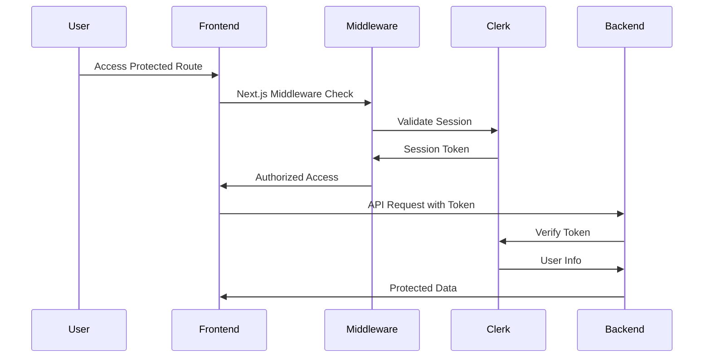
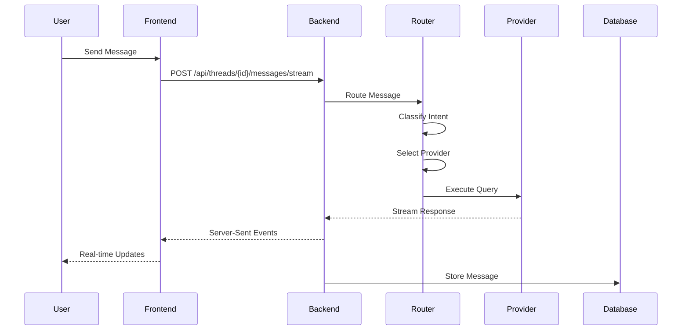
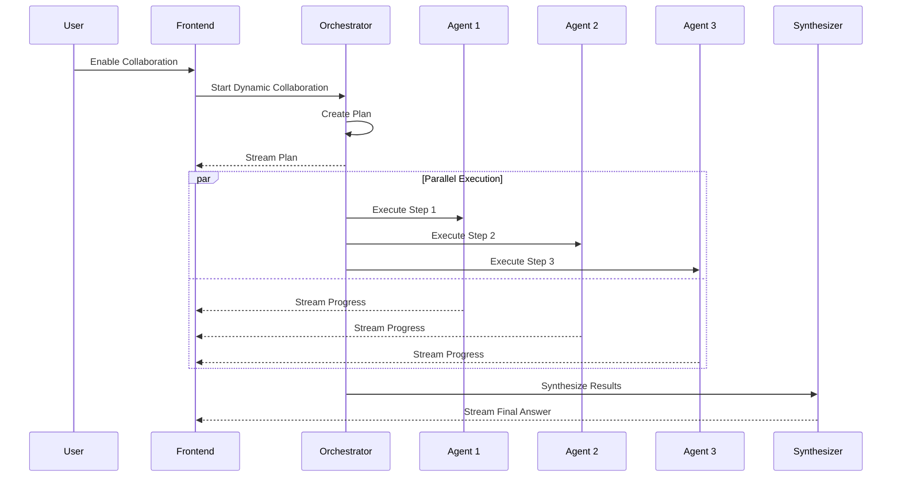

# Project Structure Overview

**Version:** 1.0  
**Last Updated:** December 26, 2025  
**Status:** Active

---

## Overview

Syntra is organized as a full-stack application with a FastAPI backend, Next.js frontend, and supporting infrastructure. This document provides a comprehensive overview of the project structure, component organization, and architectural patterns.

## Table of Contents

- [High-Level Architecture](#high-level-architecture)
- [Backend Structure](#backend-structure)
- [Frontend Structure](#frontend-structure)
- [Infrastructure & Configuration](#infrastructure--configuration)
- [Key Components](#key-components)
- [Data Flow](#data-flow)
- [Development Workflow](#development-workflow)

---

## High-Level Architecture

```
Syntra/
├── backend/                 # FastAPI Python backend
├── frontend/               # Next.js TypeScript frontend
├── docs/                   # Project documentation
├── tests/                  # Integration and E2E tests
├── scripts/                # Deployment and utility scripts
├── docker-compose.yml      # Local development infrastructure
└── README.md              # Main project documentation
```

### Technology Stack

**Backend:**
- FastAPI (async Python web framework)
- PostgreSQL (primary database)
- SQLAlchemy (async ORM)
- Alembic (database migrations)
- Qdrant (vector database for memory)
- Redis/Upstash (caching and rate limiting)
- Clerk (authentication)

**Frontend:**
- Next.js 16 (React framework with App Router)
- TypeScript (type safety)
- Tailwind CSS 4 (styling)
- Framer Motion (animations)
- Radix UI (accessible components)
- shadcn/ui (component library)

**Infrastructure:**
- Docker & Docker Compose (local development)
- AWS Parameter Store (secrets management)
- GitHub Actions (CI/CD)

---

## Backend Structure

```
backend/
├── app/
│   ├── api/                    # API route handlers
│   │   ├── auth.py            # Authentication endpoints
│   │   ├── collaboration.py   # Collaboration endpoints
│   │   ├── council.py         # Multi-agent council endpoints
│   │   ├── deps.py           # Dependency injection
│   │   ├── dynamic_collaborate.py # Dynamic collaboration endpoints
│   │   ├── providers.py      # Provider management endpoints
│   │   ├── quality_analytics.py # Analytics endpoints
│   │   ├── router.py         # Main API router
│   │   └── threads/          # Thread management endpoints
│   │       ├── attachments.py
│   │       ├── collaboration.py
│   │       ├── messages.py
│   │       ├── router.py
│   │       ├── schemas.py
│   │       └── streaming.py
│   │
│   ├── core/                  # Core infrastructure
│   │   ├── error_handlers.py # Global error handling
│   │   ├── exceptions.py     # Custom exception classes
│   │   ├── logging_config.py # Logging configuration
│   │   ├── security_middleware.py # Security headers & CORS
│   │   └── token_blacklist.py # Token invalidation
│   │
│   ├── models/               # SQLAlchemy database models
│   │   ├── __init__.py      # Model registry
│   │   ├── collaborate.py   # Collaboration data models
│   │   ├── provider_key.py  # Provider API key models
│   │   └── router_run.py    # Router execution tracking
│   │
│   ├── services/            # Business logic services
│   │   ├── council/         # Multi-agent council system
│   │   │   ├── agents/      # Individual agent implementations
│   │   │   │   ├── judge.py
│   │   │   │   ├── synthesizer.py
│   │   │   │   └── ...
│   │   │   ├── base.py      # Base council functionality
│   │   │   ├── config.py    # Council configuration
│   │   │   ├── orchestrator.py # Main orchestration logic
│   │   │   ├── quality_directive.py # Quality guidelines
│   │   │   ├── quality_validator.py # Quality validation
│   │   │   └── query_classifier.py # Query analysis
│   │   │
│   │   ├── collaborate/     # Collaboration system
│   │   │   ├── models.py    # Collaboration data models
│   │   │   ├── observability.py # Monitoring and metrics
│   │   │   ├── orchestrator_v2.py # Enhanced orchestrator
│   │   │   ├── pipeline.py  # Collaboration pipeline
│   │   │   ├── streaming.py # Real-time streaming
│   │   │   └── streaming_v2.py # Enhanced streaming
│   │   │
│   │   ├── dynamic_router/  # Intelligent routing system
│   │   │   ├── __init__.py
│   │   │   ├── integration.py # Provider integration
│   │   │   ├── intent.py    # Intent classification
│   │   │   ├── models.py    # Router data models
│   │   │   ├── route_query.py # Query routing logic
│   │   │   └── score.py     # Routing scoring
│   │   │
│   │   ├── adaptive_model_swarm.py # Multi-model coordination
│   │   ├── clerk_client.py  # Clerk authentication client
│   │   ├── coalesce.py     # Request deduplication
│   │   ├── collaboration_engine.py # Main collaboration engine
│   │   ├── collaboration_orchestrator.py # Orchestration logic
│   │   ├── collaboration_service.py # Collaboration service layer
│   │   ├── dynamic_orchestrator.py # Dynamic collaboration orchestrator
│   │   ├── enhanced_collaboration_engine.py # Enhanced collaboration with external review
│   │   ├── external_reviewers.py # Multi-model review system
│   │   ├── fallback_ladder.py # Provider fallback handling
│   │   ├── image_analyzer.py # Image processing
│   │   ├── intelligent_router.py # Main routing service
│   │   ├── media_generation.py # Media generation service
│   │   ├── memory_service.py # Vector memory service
│   │   ├── model_capabilities.py # Model capability definitions
│   │   ├── nextgen_collaboration_engine.py # Next-gen collaboration
│   │   ├── provider_dispatch.py # Provider API dispatch
│   │   ├── provider_keys.py # API key management
│   │   ├── query_classifier.py # Query intent classification
│   │   ├── routing_header.py # Routing decision tracking
│   │   ├── syntra_persona.py # Unified persona system
│   │   └── truth_arbitrator.py # Truth validation
│   │
│   ├── config/              # Configuration management
│   │   ├── collab_prompts.py # Collaboration prompts
│   │   ├── collaborate_models.py # Collaboration model configs
│   │   └── workflow_registry.py # Workflow definitions
│   │
│   ├── integrations/        # External service integrations
│   │   └── supermemory_client.py # SuperMemory API client
│   │
│   └── database.py         # Database connection setup
│
├── migrations/             # Alembic database migrations
│   └── versions/          # Migration files
│       ├── 20251127_add_router_run.py
│       ├── 20251129_add_collaborate_tables.py
│       ├── 20251216_add_quality_metrics.py
│       └── ...
│
├── tests/                 # Backend tests
│   ├── examples/         # Test examples and fixtures
│   ├── test_api_integration.py
│   ├── test_dynamic_router_integration.py
│   ├── test_dynamic_router_scoring.py
│   └── ...
│
├── alembic.ini           # Alembic configuration
├── config.py             # Application configuration
├── main.py              # FastAPI application entry point
├── requirements.txt      # Python dependencies
└── env.example          # Environment variable template
```

### Key Backend Components

**API Layer:**
- Route handlers organized by feature domain
- Dependency injection for shared services
- Comprehensive error handling and validation
- Real-time streaming support via Server-Sent Events

**Service Layer:**
- Business logic separated from API concerns
- Service-oriented architecture with clear interfaces
- Async/await throughout for performance
- Provider abstraction for AI model integration

**Data Layer:**
- SQLAlchemy async ORM with Alembic migrations
- Row-level security for multi-tenant isolation
- Vector database integration for semantic memory
- Redis caching for performance optimization

---

## Frontend Structure

```
frontend/
├── app/                    # Next.js App Router
│   ├── actions/           # Server actions
│   │   ├── collaborate.ts # Collaboration actions
│   │   ├── enhanced-collaborate.ts # Enhanced collaboration
│   │   ├── thread-collaborate.ts # Thread collaboration
│   │   └── workflow.ts   # Workflow actions
│   │
│   ├── api/              # API route handlers
│   │   ├── chat/        # Chat API integration
│   │   └── memory-debug/ # Memory debugging
│   │
│   ├── auth/            # Authentication pages
│   │   ├── callback/   # Auth callback handler
│   │   ├── sign-in/    # Sign-in page
│   │   └── sign-up/    # Sign-up page
│   │
│   ├── conversations/   # Chat interface pages
│   │   ├── [id]/       # Individual conversation page
│   │   └── page.tsx    # Conversations list
│   │
│   ├── docs/           # Documentation page
│   ├── pricing/        # Pricing page
│   ├── use-cases/      # Use cases page
│   ├── layout.tsx      # Root layout
│   ├── page.tsx        # Landing page
│   └── globals.css     # Global styles
│
├── components/            # React components
│   ├── auth/             # Authentication components
│   │   └── auth-provider.tsx # Clerk auth provider
│   │
│   ├── chat/            # Chat interface components
│   │   └── CollaborateToggle.tsx # Collaboration toggle
│   │
│   ├── collaborate/     # Collaboration UI components
│   │   ├── DetailedAnalysisPanel.tsx # Analysis display
│   │   ├── FinalAnswerCard.tsx # Final result card
│   │   ├── SelectionExplanation.tsx # Selection explanations
│   │   └── ThinkingStrip.tsx # Thinking animation
│   │
│   ├── collaboration/   # Collaboration system components
│   │   ├── collaboration-button.tsx # Collaboration trigger
│   │   └── council-chat-integration.tsx # Council integration
│   │
│   ├── loading/         # Loading state components
│   │   └── README.md   # Loading component docs
│   │
│   ├── ui/             # Base UI components (shadcn/ui)
│   │   ├── button.tsx
│   │   ├── card.tsx
│   │   ├── dialog.tsx
│   │   └── ...
│   │
│   ├── collaboration-attribution.tsx # Attribution display
│   ├── collaborate-timeline.tsx # Timeline visualization
│   ├── CollaborationIntegration.tsx # Main collaboration component
│   ├── CostDashboard.tsx # Cost tracking dashboard
│   ├── enhanced-chat-interface.tsx # Main chat interface
│   ├── enhanced-conversation-layout.tsx # Conversation layout
│   ├── enhanced-message-bubble.tsx # Message display
│   ├── enhanced-sidebar.tsx # Navigation sidebar
│   ├── features-section.tsx # Landing page features
│   ├── header.tsx      # Site header
│   ├── image-input-area.tsx # Image upload
│   ├── LoadingState.tsx # Loading states
│   ├── pricing-section.tsx # Pricing display
│   └── workspace-section.tsx # Workspace UI
│
├── hooks/                # Custom React hooks
│   ├── use-collaboration-stream.ts # Collaboration streaming
│   ├── use-dynamic-collaboration.ts # Dynamic collaboration hook
│   ├── use-phase-collaboration.ts # Phase-based collaboration
│   ├── use-sse-chat.ts # Server-sent events chat
│   ├── use-threads.ts  # Thread management
│   ├── useQualityAnalytics.ts # Quality analytics
│   └── ...
│
├── lib/                  # Utility libraries
│   ├── collaborate-types.ts # Collaboration type definitions
│   ├── models.ts        # Data models
│   ├── orchestrator-types.ts # Orchestrator types
│   ├── utils.ts         # General utilities
│   └── workflow.ts      # Workflow utilities
│
├── store/               # State management
│   └── workflow-store.ts # Zustand workflow store
│
├── types/               # TypeScript type definitions
│   └── collaborate-events.ts # Collaboration event types
│
├── middleware.ts        # Next.js middleware (auth)
├── next.config.js      # Next.js configuration
├── package.json        # Node.js dependencies
├── tailwind.config.js  # Tailwind CSS configuration
├── tsconfig.json       # TypeScript configuration
└── env.example         # Environment variable template
```

### Key Frontend Components

**App Router Structure:**
- Page-based routing with nested layouts
- Server actions for backend communication
- API routes for proxy endpoints
- Middleware for authentication

**Component Architecture:**
- Feature-based component organization
- Composition over inheritance
- Accessible components via Radix UI
- Type-safe props with TypeScript

**State Management:**
- Zustand for global state
- React hooks for local state
- Server state via React Query patterns
- Real-time updates via SSE hooks

---

## Infrastructure & Configuration

### Development Environment

```
docker-compose.yml         # Local development services
├── PostgreSQL (port 5432) # Primary database
├── Qdrant (port 6333)    # Vector database
└── Redis (port 6379)     # Caching layer

scripts/
├── dev-setup.sh          # Development environment setup
├── dev-start.sh          # Start development services
├── fetch-secrets.sh      # AWS secrets fetching
├── setup-parameter-store.sh # AWS secrets upload
└── verify-secrets.sh     # Secrets validation
```

### Configuration Files

**Environment Management:**
- `backend/env.example` - Backend environment template
- `frontend/env.example` - Frontend environment template
- `backend/env.production` - Production environment config
- AWS Parameter Store for secure secrets management

**Build Configuration:**
- `backend/requirements.txt` - Python dependencies
- `frontend/package.json` - Node.js dependencies
- `docker-compose.yml` - Development infrastructure
- `netlify.toml` - Frontend deployment config

### Documentation Structure

```
docs/
├── architecture/          # Architecture documentation
│   ├── COLLABORATION_AGENTS.md
│   ├── COLLABORATION_ARCHITECTURE.md
│   ├── COLLABORATION_IMPLEMENTATION.md
│   ├── COLLABORATION_WORKFLOW.md
│   ├── COUNCIL_IMPLEMENTATION_SUMMARY.md
│   └── COUNCIL_INTEGRATION_GUIDE.md
│
├── implementation/        # Implementation guides
│   ├── NIGHTLY_EVAL_SETUP.md
│   └── SYNTRA_EVAL_IMPLEMENTATION.md
│
├── API_REFERENCE.md      # Complete API documentation
├── AUTH_SECURITY_GUIDE.md # Authentication & security guide
├── COLLABORATION_FEATURES_GUIDE.md # Collaboration features
├── HYBRID_DEVELOPMENT.md # Development setup
├── PRODUCTION_SETUP.md   # Production deployment
├── PROJECT_STRUCTURE_OVERVIEW.md # This file
├── QUALITY_SYSTEM_QUICK_START.md # Quality system guide
└── ROUTING_WORKFLOW_ARCHITECTURE.md # Routing architecture
```

---

## Key Components

### Authentication Flow



### Chat Message Flow



### Collaboration Workflow



---

## Data Flow

### Request Processing Pipeline

1. **Authentication Layer**
   - Clerk middleware validates session tokens
   - User context extraction and org_id resolution
   - Rate limiting and permission checks

2. **Routing Layer**
   - Query classification (intent, complexity)
   - Provider selection (cost, performance, availability)
   - Fallback strategy preparation

3. **Execution Layer**
   - Provider API calls with retry logic
   - Response streaming via Server-Sent Events
   - Error handling and graceful degradation

4. **Storage Layer**
   - Message persistence to PostgreSQL
   - Vector embeddings to Qdrant
   - Caching to Redis for performance

### Collaboration Data Flow

1. **Plan Creation**
   - Query analysis for complexity assessment
   - Agent selection based on query requirements
   - Step dependency mapping

2. **Parallel Execution**
   - Multiple agents process query simultaneously
   - Real-time progress streaming to frontend
   - Result collection and validation

3. **Synthesis**
   - Agent output combination and conflict resolution
   - Final answer generation with provenance tracking
   - Quality assessment and confidence scoring

---

## Development Workflow

### Local Development Setup

1. **Prerequisites Installation**
   ```bash
   # Install dependencies
   python 3.9+ 
   node.js 18+
   docker & docker-compose
   ```

2. **Environment Configuration**
   ```bash
   # Setup environment files
   ./scripts/dev-setup.sh
   
   # Or fetch from AWS Parameter Store
   ./scripts/fetch-secrets.sh
   ```

3. **Infrastructure Startup**
   ```bash
   # Start supporting services
   docker-compose up -d
   
   # Verify services
   docker-compose ps
   ```

4. **Application Startup**
   ```bash
   # Backend
   cd backend
   python -m venv venv
   source venv/bin/activate
   pip install -r requirements.txt
   alembic upgrade head
   python main.py
   
   # Frontend (new terminal)
   cd frontend
   npm install
   npm run dev
   ```

### Code Organization Principles

**Backend Organization:**
- **Feature-based modules** - Group related functionality
- **Service layer separation** - Business logic separate from API
- **Dependency injection** - Testable and modular components
- **Async-first design** - Performance through non-blocking operations

**Frontend Organization:**
- **Component composition** - Reusable UI building blocks
- **Feature co-location** - Related files grouped together
- **Type safety** - Comprehensive TypeScript coverage
- **Performance optimization** - Code splitting and lazy loading

### Development Best Practices

**Code Quality:**
- Comprehensive type checking (TypeScript/Python typing)
- Automated linting (ESLint, Ruff, Black)
- Unit and integration testing
- Git hooks for quality gates

**Security:**
- Environment variable management
- API key encryption at rest
- HTTPS enforcement in production
- Security headers and CORS configuration

**Performance:**
- Response caching strategies
- Database query optimization
- Frontend code splitting
- CDN usage for static assets

---

This project structure overview provides a comprehensive understanding of Syntra's architecture, component organization, and development patterns to facilitate effective development and maintenance.