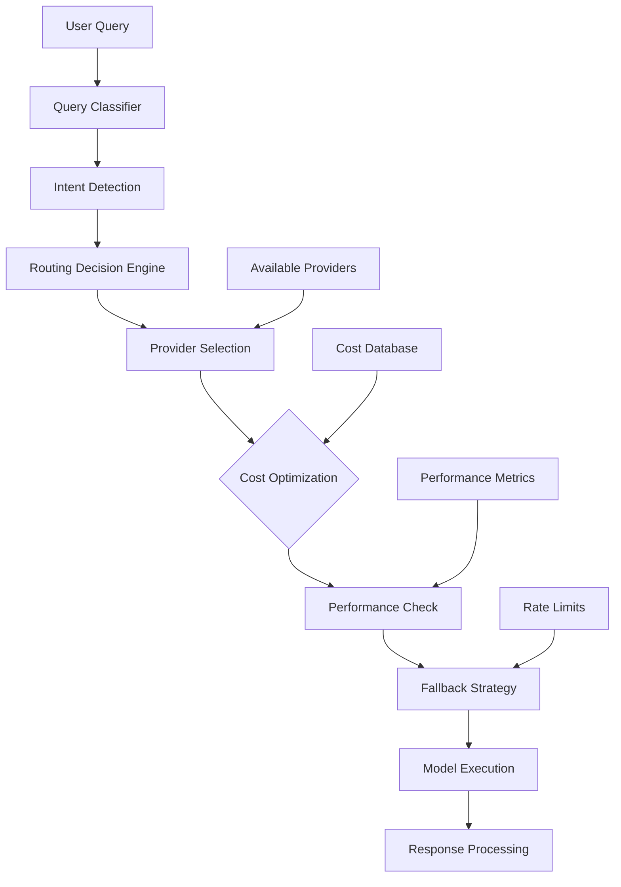
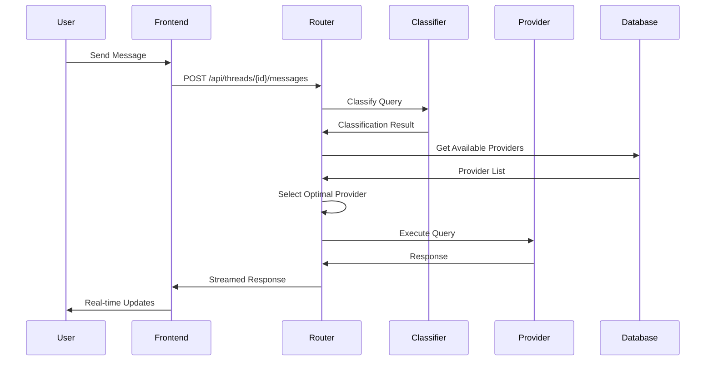

# Intelligent Routing & Workflow Architecture Guide

**Version:** 1.0  
**Last Updated:** December 26, 2025  
**Status:** Active

---

## Overview

Syntra implements an intelligent routing system that automatically selects the optimal AI provider and model based on query classification, cost optimization, and performance metrics. This guide covers the routing architecture, workflow orchestration, and implementation details.

## Table of Contents

- [Intelligent Routing System](#intelligent-routing-system)
- [Query Classification](#query-classification)
- [Provider Selection Algorithm](#provider-selection-algorithm)
- [Workflow Orchestration](#workflow-orchestration)
- [Dynamic Router Implementation](#dynamic-router-implementation)
- [Performance Optimization](#performance-optimization)
- [Configuration & Tuning](#configuration--tuning)

---

## Intelligent Routing System

### Architecture Overview



### Core Components

**File:** `backend/app/services/intelligent_router.py`

```python
class IntelligentRouter:
    """Makes intelligent routing decisions for LLM selection."""
    
    async def route(
        self,
        db: AsyncSession,
        org_id: str,
        query: str,
        conversation_history: Optional[List[Dict[str, str]]] = None,
        preferred_provider: Optional[ProviderType] = None,
        preferred_model: Optional[str] = None
    ) -> RoutingDecision
```

**Routing Decision Components:**
1. **Query Classification** - Analyze intent and complexity
2. **Provider Availability** - Check org-specific provider keys
3. **Cost Optimization** - Select cheapest capable model
4. **Performance Metrics** - Consider latency and success rates
5. **Fallback Strategy** - Define backup options

---

## Query Classification

### Classification Categories

**Intent Types:**
- `social_chat` - Casual conversation, greetings
- `qa_retrieval` - Factual questions, information lookup
- `coding_help` - Programming assistance, code review
- `editing_writing` - Content creation, editing
- `reasoning_math` - Complex reasoning, calculations
- `web_search` - Requires real-time information

**Complexity Levels:**
- `simple` - Basic queries, single-step tasks
- `moderate` - Multi-step reasoning, context awareness
- `complex` - Advanced reasoning, long context

**Context Considerations:**
- Conversation length
- Previous message complexity
- User interaction patterns

### Implementation

**File:** `backend/app/services/query_classifier.py`

```python
@dataclass
class QueryClassification:
    intent: str
    complexity: str
    confidence: float
    requires_web_search: bool
    estimated_tokens: int
    context_length: int

class QueryClassifier:
    def classify(
        self, 
        query: str, 
        conversation_history: Optional[List[Dict[str, str]]] = None
    ) -> QueryClassification:
        # Intent detection logic
        intent = self._detect_intent(query)
        
        # Complexity analysis
        complexity = self._analyze_complexity(query, conversation_history)
        
        # Web search requirement
        requires_web = self._needs_web_search(query)
        
        return QueryClassification(...)
```

**Classification Rules:**

| Query Pattern | Intent | Complexity | Preferred Provider |
|--------------|---------|------------|-------------------|
| "How are you?" | `social_chat` | `simple` | Gemini Flash (cheapest) |
| "Explain quantum computing" | `qa_retrieval` | `moderate` | GPT-4o-mini |
| "Write a Python function" | `coding_help` | `moderate` | GPT-4o |
| "What's the latest news?" | `web_search` | `simple` | Perplexity |
| "Solve this math proof" | `reasoning_math` | `complex` | O1-mini |

---

## Provider Selection Algorithm

### Cost-First Optimization

**Cost Tiers (per 1M tokens):**

| Provider | Model | Cost | Use Case |
|----------|--------|------|----------|
| Gemini | `gemini-2.5-flash` | $0.075 | **CHEAPEST** - Simple tasks |
| OpenAI | `gpt-4o-mini` | $0.15 | **LOW** - Moderate reasoning |
| Kimi | `moonshot-v1-8k` | $0.12 | **LOW** - Alternative option |
| Perplexity | `sonar` | $1.00 | **MEDIUM** - Web search |
| OpenAI | `gpt-4o` | $2.50 | **HIGH** - Complex tasks |
| Perplexity | `sonar-pro` | $3.00 | **HIGH** - Advanced search |
| OpenAI | `o1-mini` | $3.00 | **HIGH** - Reasoning |
| OpenAI | `o1` | $15.00 | **PREMIUM** - Advanced reasoning |

### Selection Logic

```python
async def _select_best_provider(
    self,
    classification: QueryClassification,
    available_providers: Set[ProviderType],
    performance_cache: Dict
) -> Tuple[ProviderType, str]:
    
    # Step 1: Filter by capability requirements
    capable_providers = self._filter_by_capability(
        classification.intent, 
        available_providers
    )
    
    # Step 2: Sort by cost (ascending)
    cost_sorted = sorted(
        capable_providers, 
        key=lambda p: MODEL_COSTS.get((p[0], p[1]), float('inf'))
    )
    
    # Step 3: Apply performance filters
    for provider, model in cost_sorted:
        if self._meets_performance_threshold(provider, model, performance_cache):
            return provider, model
    
    # Step 4: Fallback to most reliable
    return self._get_fallback_provider(available_providers)
```

### Provider Capabilities Matrix

| Intent | Primary Provider | Fallback | Reason |
|--------|-----------------|----------|--------|
| `social_chat` | Gemini Flash | GPT-4o-mini | Cost optimization |
| `qa_retrieval` | GPT-4o-mini | Gemini Flash | Balanced cost/quality |
| `coding_help` | GPT-4o | GPT-4o-mini | Code quality priority |
| `web_search` | Perplexity Sonar | Perplexity Pro | Real-time data access |
| `reasoning_math` | O1-mini | GPT-4o | Advanced reasoning |
| `editing_writing` | GPT-4o | Gemini Pro | Creative quality |

---

## Workflow Orchestration

### Request Flow Architecture



### Streaming Implementation

**Server-Sent Events (SSE):**
```python
async def stream_response(
    query: str,
    routing_decision: RoutingDecision
) -> AsyncGenerator[str, None]:
    
    # Send thinking preamble
    yield f"data: {json.dumps({'type': 'thinking', 'content': 'Analyzing with ' + routing_decision.provider})}\n\n"
    
    # Stream actual response
    async for chunk in provider_adapter.stream(query):
        yield f"data: {json.dumps({'type': 'content', 'content': chunk})}\n\n"
    
    yield f"data: {json.dumps({'type': 'done'})}\n\n"
```

**Frontend Consumption:**
```typescript
const eventSource = new EventSource('/api/threads/123/messages/stream');

eventSource.onmessage = (event) => {
    const data = JSON.parse(event.data);
    
    switch (data.type) {
        case 'thinking':
            setThinkingContent(data.content);
            break;
        case 'content':
            appendToResponse(data.content);
            break;
        case 'done':
            setIsComplete(true);
            break;
    }
};
```

### Context Management

**Memory System:**
- **Vector Memory** - Semantic similarity search via Qdrant
- **Rolling Context** - Last N messages with smart truncation
- **Cross-Provider Context** - Maintains context across model switches
- **Memory Coalescing** - Deduplicates concurrent identical requests

**Context Window Management:**
```python
def manage_context_window(
    messages: List[Dict],
    max_tokens: int,
    model_context_limit: int
) -> List[Dict]:
    
    # Always preserve system message and last user message
    system_msg = messages[0] if messages[0]['role'] == 'system' else None
    last_user_msg = next(m for m in reversed(messages) if m['role'] == 'user')
    
    # Calculate available space
    reserved_tokens = estimate_tokens([system_msg, last_user_msg])
    available_tokens = model_context_limit - reserved_tokens - max_tokens
    
    # Include as much recent context as possible
    context_messages = []
    current_tokens = 0
    
    for message in reversed(messages[1:-1]):
        msg_tokens = estimate_tokens([message])
        if current_tokens + msg_tokens <= available_tokens:
            context_messages.insert(0, message)
            current_tokens += msg_tokens
        else:
            break
    
    return [system_msg] + context_messages + [last_user_msg]
```

---

## Dynamic Router Implementation

### Multi-Agent Orchestration

**File:** `backend/app/services/dynamic_orchestrator.py`

The dynamic router orchestrates multiple AI agents for complex queries:

1. **Query Analysis** - Determine optimal collaboration strategy
2. **Agent Selection** - Choose specialized agents based on query type
3. **Execution Planning** - Define agent execution order and dependencies
4. **Result Synthesis** - Combine agent outputs into coherent response

### Agent Types and Capabilities

```typescript
// File: frontend/lib/orchestrator-types.ts

type CollabRole = 'analyst' | 'researcher' | 'creator' | 'critic' | 'synthesizer'

const COLLAB_ROLE_DISPLAY = {
  analyst: {
    name: 'Analyst',
    description: 'Clarifies and decomposes the task',
    icon: '🔍'
  },
  researcher: {
    name: 'Researcher', 
    description: 'Gathers facts and references',
    icon: '📚'
  },
  creator: {
    name: 'Creator',
    description: 'Produces the draft solution', 
    icon: '✨'
  },
  critic: {
    name: 'Critic',
    description: 'Evaluates and identifies issues',
    icon: '🎯' 
  },
  synthesizer: {
    name: 'Synthesizer',
    description: 'Creates the final polished answer',
    icon: '🔮'
  }
}
```

### Collaboration Planning

```python
class DynamicOrchestrator:
    async def create_collaboration_plan(
        self,
        query: str,
        settings: UserSettings
    ) -> CollaborationPlan:
        
        # Analyze query complexity
        complexity = await self._analyze_query_complexity(query)
        
        # Select appropriate agents
        selected_agents = self._select_agents_for_complexity(complexity)
        
        # Create execution plan
        steps = []
        for i, agent_role in enumerate(selected_agents):
            model_id = self._select_model_for_role(agent_role, settings.priority)
            
            steps.append(CollabStep(
                step_index=i,
                role=agent_role,
                model_id=model_id,
                purpose=self._get_role_purpose(agent_role),
                needs_previous_steps=[j for j in range(i)],
                estimated_importance=self._estimate_importance(agent_role, complexity)
            ))
        
        return CollaborationPlan(
            pipeline_summary=f"Multi-agent collaboration with {len(steps)} specialized agents",
            steps=steps,
            planning_time_ms=planning_duration
        )
```

---

## Performance Optimization

### Request Coalescing

**Deduplication Strategy:**
```python
class RequestCoalescer:
    def __init__(self):
        self._active_requests = {}  # key -> Future
        self._ttl = 5.0  # 5 seconds
    
    async def coalesce(self, request_key: str, request_func: Callable) -> Any:
        # Check if identical request is already in progress
        if request_key in self._active_requests:
            return await self._active_requests[request_key]
        
        # Create new request
        future = asyncio.create_task(request_func())
        self._active_requests[request_key] = future
        
        try:
            result = await future
            return result
        finally:
            # Clean up after completion
            if request_key in self._active_requests:
                del self._active_requests[request_key]
```

**Coalescing Key Generation:**
```python
def generate_coalescing_key(
    provider: ProviderType,
    model: str,
    messages: List[Dict],
    org_id: str,
    thread_id: Optional[str] = None
) -> str:
    # Create deterministic hash of request parameters
    content = {
        "provider": provider.value,
        "model": model,
        "messages": messages,
        "org_id": org_id,
        "thread_id": thread_id
    }
    
    hash_input = json.dumps(content, sort_keys=True)
    return hashlib.sha256(hash_input.encode()).hexdigest()[:16]
```

### Rate Limiting

**Provider-Specific Rate Limits:**
```bash
# Environment Configuration
PERPLEXITY_RPS=1
PERPLEXITY_BURST=2
PERPLEXITY_CONCURRENCY=3

OPENAI_RPS=2
OPENAI_BURST=5
OPENAI_CONCURRENCY=5

GEMINI_RPS=2
GEMINI_BURST=5
GEMINI_CONCURRENCY=5
```

**Pacer Implementation:**
```python
class ProviderPacer:
    def __init__(self, rps: float, burst: int, concurrency: int):
        self.rps = rps
        self.burst = burst
        self.concurrency = concurrency
        self._semaphore = asyncio.Semaphore(concurrency)
        self._token_bucket = TokenBucket(rps, burst)
    
    async def acquire(self):
        async with self._semaphore:
            await self._token_bucket.acquire()
            return self
```

### Caching Strategy

**Response Caching:**
- **TTL:** 5 minutes for identical requests
- **Key:** Hash of provider + model + messages
- **Storage:** Redis for distributed caching
- **Invalidation:** Automatic expiration and manual cache busting

**Memory Caching:**
- **Vector embeddings** cached for semantic search
- **Provider performance metrics** cached for routing decisions
- **Authentication tokens** cached for 5 minutes

---

## Configuration & Tuning

### Environment Variables

```bash
# Intelligent Routing
INTELLIGENT_ROUTING_ENABLED=1
MEMORY_ENABLED=1

# Provider Rate Limits
PERPLEXITY_RPS=1
PERPLEXITY_BURST=2
PERPLEXITY_CONCURRENCY=3

OPENAI_RPS=2
OPENAI_BURST=5
OPENAI_CONCURRENCY=5

# Query Rewriting
FEATURE_COREWRITE=1

# Performance Tuning
DEFAULT_REQUESTS_PER_DAY=1000
DEFAULT_TOKENS_PER_DAY=100000
```

### Model Registry Configuration

```python
# File: backend/app/services/model_registry.py

VALID_MODELS = {
    ProviderType.OPENAI: [
        "gpt-4o", "gpt-4o-mini", "o1", "o1-mini"
    ],
    ProviderType.GEMINI: [
        "gemini-2.5-pro", "gemini-2.5-flash"
    ],
    ProviderType.PERPLEXITY: [
        "sonar-pro", "sonar", "sonar-reasoning-pro", "sonar-reasoning"
    ],
    ProviderType.KIMI: [
        "moonshot-v1-8k", "moonshot-v1-32k", "moonshot-v1-128k", "kimi-k2-turbo-preview"
    ]
}
```

### Performance Tuning

**Router Performance Metrics:**
- Query classification time: <50ms target
- Provider selection time: <20ms target
- Total routing overhead: <100ms target
- Cache hit rate: >80% target

**Optimization Strategies:**
1. **Async Processing** - All provider calls are async
2. **Connection Pooling** - Persistent HTTP connections
3. **Request Batching** - Batch similar requests when possible
4. **Circuit Breakers** - Fail fast on provider outages
5. **Graceful Degradation** - Fallback to simpler models when needed

### Monitoring & Observability

**Key Metrics:**
```python
# Routing decision tracking
router_decisions_total = Counter('router_decisions_total', ['provider', 'model', 'intent'])
router_decision_time = Histogram('router_decision_time_seconds')

# Provider performance
provider_request_duration = Histogram('provider_request_duration_seconds', ['provider', 'model'])
provider_errors_total = Counter('provider_errors_total', ['provider', 'model', 'error_type'])

# Cost tracking
token_usage_total = Counter('token_usage_total', ['provider', 'model', 'org_id'])
estimated_cost_total = Counter('estimated_cost_total', ['provider', 'model', 'org_id'])
```

**Health Checks:**
- Provider API availability
- Database connection health
- Redis cache connectivity
- Model registry validation

---

This routing and workflow architecture guide provides comprehensive coverage of Syntra's intelligent routing system, from query classification to multi-agent orchestration and performance optimization.